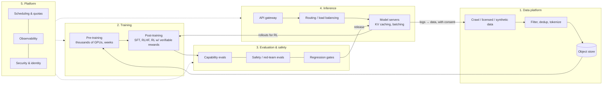

# 00 — A frontier-lab AI platform, built from open source

## What a frontier lab actually runs

Labs like Anthropic, OpenAI, Google DeepMind and Meta publish only fragments
of their internal stacks. From public talks, papers and job descriptions,
though, the *shape* is well understood. There are five big systems, all on
a shared compute substrate:

Key insights that shape the design:

1. **Training and inference share hardware.** GPUs are the scarce, expensive
   resource, and a scheduler (quotas, priorities, preemption) decides who
   gets them. RL post-training literally *runs inference inside training*
   (rollouts).
2. **Inference is a distributed-systems problem.** At scale the hard parts
   are routing requests to where the KV cache already is, batching, cache
   tiering, prefill/decode disaggregation, autoscaling with slow cold
   starts, and multi-tenant fairness.
3. **Everything durable lives in object storage.** That covers datasets,
   checkpoints, eval results and released weights. Compute is ephemeral and
   fails often.
4. **Evaluation is a gate.** Nothing ships, whether a new checkpoint, a
   quantization or a serving change, without passing evals.
5. **Failures are normal at scale.** With 10k GPUs, something breaks every
   few hours, so checkpointing, automatic restarts and health checks are
   first-class concerns.

## The OSS mapping

| Frontier-lab system | OSS in this repo | Folder |
|---|---|---|
| Cluster networking | **Cilium** (eBPF, kube-proxy-free, Hubble) | `platform/00-cilium` |
| GPU enablement & health | **NVIDIA GPU Operator** (driver, toolkit, device plugin, DCGM, MIG) | `platform/05-gpu-operator` |
| Job scheduling, quotas, fair share | **Kueue** (+ kube-scheduler) | `platform/09-kueue` |
| Multi-node replicas | **LeaderWorkerSet**, JobSet | `platform/08-lws` |
| Distributed training | **Kubeflow Trainer** (PyTorch/torchrun, DeepSpeed), **KubeRay** (Ray Train) | `training/03`, `training/04` |
| RL / post-training | veRL / OpenRLHF / NeMo-RL / SkyRL on **KubeRay** (docs) | `docs/06` |
| Experiment tracking & registry | **MLflow** | `training/02-mlflow` |
| Object store | **MinIO** (or SeaweedFS/Ceph RGW) | `training/01-object-storage` |
| API gateway | **Envoy Gateway + Envoy AI Gateway** | `gateway/01–03` |
| Inference-aware load balancing | **vLLM production-stack router**, **Gateway API Inference Extension**, **llm-d** | `inference/04`, `gateway/04` |
| Model server | **vLLM** (also SGLang, TensorRT-LLM via Dynamo) | `inference/02–05` |
| KV-cache tiering & sharing | **LMCache** (also Mooncake, NIXL) | `inference/03-lmcache` |
| Autoscaling | **KEDA** on vLLM metrics; Ray autoscaler | `inference/06-autoscaling` |
| Batch / offline inference | **Ray Data + vLLM** | `training/05-jobs/rayjob-batch-inference.yaml` |
| Evals | **lm-evaluation-harness**, `vllm bench` | `evaluation/` |
| Observability | **Prometheus, Grafana, DCGM exporter, Hubble** (+ OpenTelemetry) | `platform/06-monitoring` |
| Identity / secrets / policy / runtime | **Keycloak, OpenBao + ESO, Kyverno, Falco, Trivy** | `security/` |
| Safety classifiers | **Llama Guard** on vLLM, NeMo Guardrails | `security/06-ai-guardrails` |

## Lab scale versus hyperscale

The **same components** work at both ends. What changes is topology,
redundancy and a handful of extra systems:

| Concern | Lab (this repo) | Hyperscale (see [docs/10](10-scaling-to-hyperscale.md)) |
|---|---|---|
| GPUs | 1–64 | 10k–100k+ across regions |
| Clusters | 1 | many (per region / per purpose), MultiKueue, fleet management |
| Network | 10–100 GbE, maybe RoCE | 400–800 Gb/s InfiniBand/RoCE rails per GPU, rail-optimized fat-tree |
| Storage | NFS + MinIO | parallel FS (Lustre/Weka/GPFS/DAOS) + massive object store |
| Training | DDP/FSDP, a few nodes | 3D/4D/5D parallelism (Megatron, torchtitan), topology-aware placement |
| Inference | one router per model | prefill/decode disaggregation, wide expert parallelism, global KV pools, multi-region traffic management |
| Ops | `kubectl` + Grafana | GitOps, automated node health remediation, SLO-based on-call |

## How to use this repo to learn

1. **kind first** (`kind/`). Learn the control-plane interactions with no
   GPUs: gateway → router → "model", Kueue preemption, KEDA scaling.
2. **One GPU**. Run `inference/02-vllm-basic`, then LMCache, then the
   production stack. Measure each step with `evaluation/01-load-test`.
3. **Several GPUs**. Run multi-model serving, autoscaling, training jobs
   competing with inference through Kueue, and the LoRA train→serve loop.
4. **Several nodes**. Run multi-node training (DDP/FSDP with NCCL), then
   multi-node inference (LWS), and then RDMA networking.
5. **Read [docs/10](10-scaling-to-hyperscale.md)** and plan what you'd
   change for 1000× the size.

[docs/09-learning-path.md](09-learning-path.md) turns this into concrete
exercises.
