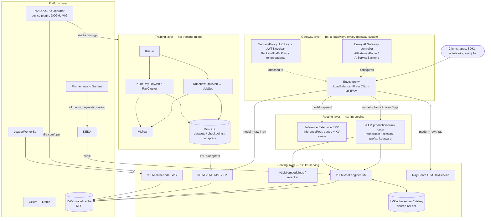
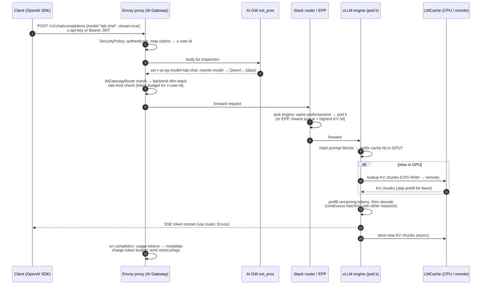
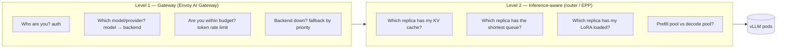
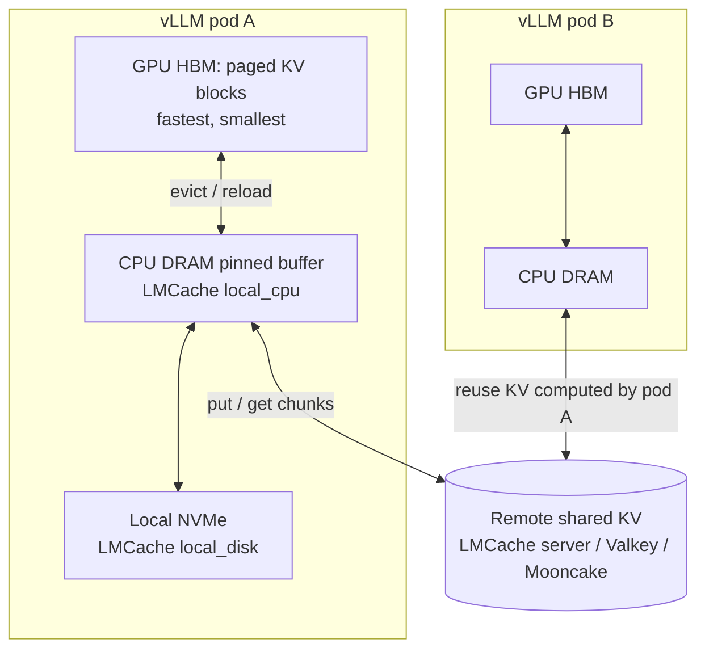
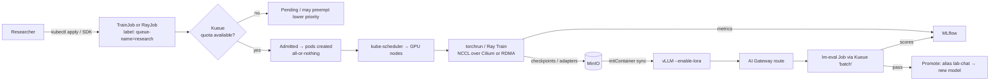

# 01 — Architecture

All diagrams are Mermaid, so they render on GitHub and in most Markdown
viewers.

## 1. Layered view

## 2. Namespaces and who owns what

| Namespace | Contents | Installed by |
|---|---|---|
| `kube-system` | Cilium, Hubble | `platform/00-cilium` |
| `cert-manager` | cert-manager, lab CA | `platform/03` |
| `nfs-provisioner` | NFS RWX provisioner | `platform/04` |
| `gpu-operator` | NVIDIA operator stack | `platform/05` |
| `monitoring` | Prometheus, Grafana, Alertmanager | `platform/06` |
| `keda`, `lws-system`, `kueue-system` | operators | `platform/07–09` |
| `envoy-gateway-system` | Envoy Gateway controller **and the Envoy proxy pods** | `gateway/01` |
| `envoy-ai-gateway-system` | AI Gateway controller (extension server) | `gateway/02` |
| `ai-gateway` | `Gateway`, `AIGatewayRoute`s, backends, auth policies | `gateway/03` |
| `llm-serving` | vLLM, routers, LMCache, EPP, RayService | `inference/*` |
| `training` | TrainJobs, RayJobs, dev RayCluster, LocalQueue `research` | `training/*` |
| `mlops` | MinIO, MLflow | `training/01–02` |
| `evaluation` | benchmark & eval Jobs, LocalQueue `batch` | `evaluation/*` |
| `security` | Keycloak, OpenBao, Falco | `security/*` |

## 3. Life of an inference request

Where latency goes:

* **TTFT** (time to first token) = queueing + prefill. Prefix caching and
  LMCache attack the prefill part. Autoscaling and routing attack queueing.
* **TPOT/ITL** (time per output token) = decode step time. It depends on
  batch size, model size, memory bandwidth, speculative decoding and
  parallelism.

## 4. Two levels of routing, and why both

Level 1 is about **tenants and providers**. Level 2 is about **GPU
efficiency**. A plain Kubernetes Service (random L4 balancing) destroys
cache locality, and at scale that is the difference between, for example,
a 200 ms and a 2 s TTFT on long-context traffic.

## 5. KV-cache hierarchy (LMCache)

## 6. Training and the train → serve loop

## 7. Control loops at a glance

| Loop | Watches | Acts on |
|---|---|---|
| GPU Operator | node hardware | installs driver/toolkit, advertises `nvidia.com/gpu` |
| Kueue | queued Workloads + quotas | unsuspends jobs, preempts lower priority |
| KEDA | Prometheus vLLM metrics | HPA replica count of vLLM Deployments |
| Ray autoscaler | Ray resource demand | RayCluster worker pod count |
| Envoy Gateway + AI GW | Gateway API + AI CRDs | Envoy xDS config |
| Inference Extension EPP | vLLM pod metrics | per-request endpoint choice |
| LWS | group pod health | recreates entire leader+worker group |
| ESO | OpenBao secrets | Kubernetes Secrets |
| Kyverno / Falco | API requests / syscalls | policy reports, alerts |
