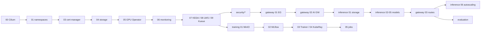

# 04 — Install runbook (GPU lab)

Install layer by layer and verify each layer before moving on. Every step is
idempotent (`helm upgrade --install` / `kubectl apply`).



## 0. Tools

```bash
kubectl version --client; helm version            # helm ≥ 3.14 (OCI charts)
# optional: cilium, hubble, jq, yq, kind
```

## 1. Platform

```bash
# Cilium on a cluster bootstrapped without CNI / kube-proxy (docs/03)
API_SERVER_IP=10.0.0.10 ./platform/00-cilium/install.sh
vi platform/00-cilium/lb-ipam.yaml && kubectl apply -f platform/00-cilium/lb-ipam.yaml
cilium status --wait

./platform/01-namespaces/install.sh
./platform/03-cert-manager/install.sh
NFS_SERVER=10.0.0.5 NFS_PATH=/export/k8s ./platform/04-storage/install.sh

DRIVER_ENABLED=false ./platform/05-gpu-operator/install.sh   # true if hosts have no driver
kubectl apply -f platform/05-gpu-operator/test-gpu-pod.yaml
kubectl logs gpu-smoke-test            # ✅ nvidia-smi table

./platform/06-monitoring/install.sh
./platform/07-keda/install.sh
./platform/08-lws/install.sh
./platform/09-kueue/install.sh
vi platform/09-kueue/queues.yaml && kubectl apply -f platform/09-kueue/queues.yaml
```

✅ `./scripts/verify.sh` shows GPUs on the nodes, all DaemonSets ready, and
the ClusterQueues `Active`.

## 2. Security (recommended before exposing anything)

```bash
./security/02-secrets-openbao-eso/install.sh
kubectl -n security exec -it openbao-0 -- bao kv put secret/ai-lab/huggingface token=hf_xxx
kubectl apply -f security/02-secrets-openbao-eso/external-secrets.yaml   # creates hf-token
./security/03-policy-kyverno/install.sh       # audit mode
./security/04-runtime-falco/install.sh
./security/05-vuln-trivy/install.sh
./security/01-identity-keycloak/install.sh    # optional: switch gateway auth to JWT later
```

No OpenBao? Then use
`kubectl -n llm-serving create secret generic hf-token --from-literal=token=hf_xxx`.

## 3. Gateway

```bash
./gateway/01-envoy-gateway/install.sh          # WITH_RATELIMIT=true for token budgets
./gateway/02-envoy-ai-gateway/install.sh
kubectl apply -f gateway/03-ai-routes/gateway.yaml
kubectl get gateway -n ai-gateway              # ✅ PROGRAMMED=True, ADDRESS = LB IP
```

## 4. Inference

```bash
kubectl apply -f inference/01-model-storage/model-cache-pvc.yaml
kubectl apply -f inference/01-model-storage/download-model-job.yaml   # optional pre-warm

# Learn path: one engine by hand first
kubectl apply -f inference/02-vllm-basic/vllm-qwen-7b.yaml

# Then the production stack
VALUES=values-1gpu.yaml ./inference/04-production-stack/install.sh
# or: SHARED_KV=true VALUES=values-multi-model.yaml ./inference/04-production-stack/install.sh

# Wire the gateway
kubectl apply -f gateway/03-ai-routes/backends.yaml -f gateway/03-ai-routes/ai-gateway-route.yaml
kubectl apply -f gateway/03-ai-routes/security-policy.yaml

GW=$(kubectl get gateway ai-gateway -n ai-gateway -o jsonpath='{.status.addresses[0].value}')
curl -s http://$GW/v1/chat/completions -H 'content-type: application/json' \
  -H 'x-api-key: sk-lab-alice-change-me' \
  -d '{"model":"lab-chat","messages":[{"role":"user","content":"hello"}]}' | jq .choices[0].message
```

Autoscaling:

```bash
kubectl apply -f inference/06-autoscaling/scaledobject-vllm-basic.yaml
kubectl apply -f evaluation/01-load-test/bench-random.yaml     # generate load, watch replicas
```

## 5. Training

```bash
./training/01-object-storage/install.sh
./training/02-mlflow/install.sh
./training/03-kubeflow-trainer/install.sh
./training/04-kuberay/install.sh

kubectl apply -f training/05-jobs/trainjob-pytorch-ddp.yaml
kubectl get workloads -n training; kubectl get trainjob -n training
kubectl apply -f training/05-jobs/trainjob-lora-finetune.yaml
# after it finishes:
kubectl apply -f inference/05-model-catalog/lora-multi-adapter.yaml
```

## 6. Evaluation

```bash
kubectl apply -f evaluation/01-load-test/bench-shared-prefix.yaml
kubectl apply -f evaluation/02-lm-eval/lm-eval-gsm8k.yaml   # set GATEWAY first (see file)
```

## Uninstall

`helm uninstall <release> -n <ns>` in reverse order. PVCs use
`reclaimPolicy: Retain`, so downloaded models survive; delete them on the NFS
server when you're done. For kind: `kind/down.sh`.
