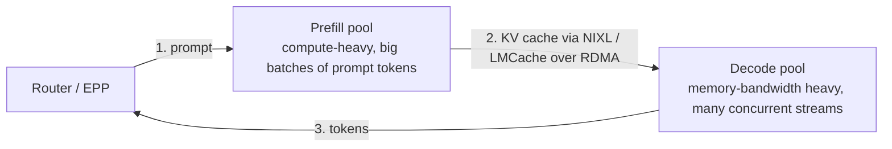

# 05 — Inference deep dive

## 1. What an LLM server actually does

```
request ─► tokenize ─► PREFILL (process all prompt tokens in parallel; compute-bound)
                         │ writes K,V tensors for every layer & token → KV cache
                         ▼
                       DECODE loop (1 token / step for each sequence; memory-bandwidth-bound)
                         │ reads entire KV cache each step
                         ▼
                       detokenize ─► stream tokens (SSE)
```

* **KV cache** = 2 × layers × kv_heads × head_dim × bytes per token.
  Llama-3.1-8B in bf16 needs 2×32×8×128×2 B = **128 KiB/token**, so a
  32k-token conversation holds **4 GiB** of KV. The KV cache, not the
  weights, limits concurrency.
* **PagedAttention** (vLLM) stores KV in fixed-size blocks like OS pages,
  which means no fragmentation and lets blocks be shared between sequences.
* **Continuous batching**: new requests join the running batch at every
  decode step, which keeps the GPU busy.
* **Prefix caching**: block hashes of prompt prefixes let a new request with
  the same system prompt, document or chat history reuse the KV and **skip
  that part of prefill**.
* **Chunked prefill**: long prefills are split and interleaved with decodes,
  so one 100k-token prompt doesn't freeze everyone's token stream.

## 2. Metrics that matter

| Metric | User-facing meaning | Main levers |
|---|---|---|
| TTFT (time to first token) | "is it responding?" | queueing (scale out, routing), prefix/KV cache hits, chunked prefill, P/D disaggregation |
| TPOT / ITL | streaming speed | batch size (`--max-num-seqs`), quantization, speculative decoding, TP |
| Throughput (tokens/s/GPU) | cost | larger batches, FP8, KV cache size (`--gpu-memory-utilization`, FP8 KV) |
| Goodput | throughput **within SLO** | all of the above, plus admission control |

## 3. Parallelism for serving

| | Splits | Use when |
|---|---|---|
| **TP** tensor parallel | each layer's matrices across GPUs; all-reduce every layer | model doesn't fit on 1 GPU; needs NVLink; keep inside a node |
| **PP** pipeline parallel | layers across GPUs or nodes | model doesn't fit in one node |
| **DP** data parallel | full replicas | throughput (this is what replicas and autoscaling are) |
| **EP** expert parallel | MoE experts across GPUs | MoE models (DeepSeek, Qwen3-MoE, Llama 4); "wide EP" across many nodes at scale |
| **CP** context/sequence parallel | long sequences across GPUs | very long contexts |

## 4. KV caching beyond one GPU: LMCache

GPU prefix caches are small and private. LMCache adds:

* **Offload tiers**: GPU → CPU DRAM → local disk → remote store (LMCache
  server, Valkey/Redis, Mooncake, S3-like). The cache moves from tens of GB
  to TBs.
* **Cross-replica reuse**: replica B fetches KV that replica A computed.
  This matters once you autoscale, because new replicas start warm.
* **KV transfer** between prefill and decode workers (disaggregation), and
  **CacheBlend** for reusing KV of non-prefix chunks (RAG documents in a
  different order).

When does it pay off? It pays off for workloads with large repeated context:
long system prompts, agents re-sending growing histories, RAG over a popular
corpus, multi-turn chat, and code assistants re-sending repositories. Use
`evaluation/01-load-test/bench-shared-prefix.yaml` to measure it.

## 5. Routing strategies

| Strategy | Where | Good for |
|---|---|---|
| round-robin / least-request | any LB | uniform short requests |
| session affinity (`x-user-id`) | stack router `session` | multi-turn chat, where the history's KV stays on one pod |
| prefix-aware (hash of prompt prefix) | stack router `prefixaware`, GIE EPP prefix scorer | shared system prompts or documents |
| KV-aware (ask the cache index who holds the blocks) | stack router `kvaware` + LMCache controller; llm-d KV-cache indexer | maximal reuse at scale |
| load-aware (queue depth, KV utilisation) | GIE EPP | avoiding hot spots, tail latency |
| LoRA-affinity | GIE EPP | many adapters, where routing to pods that already have it loaded matters |
| intent/semantic | vLLM Semantic Router | cost: send easy queries to small models |

The scoring in modern schedulers (GIE/llm-d) is a **weighted sum** of
several scorers (prefix-hit, queue, KV-utilisation, LoRA), and you tune the
weights.

## 6. Prefill/decode disaggregation (P/D)



Prefill and decode have opposite hardware profiles. Splitting them lets each
pool scale and batch independently and removes prefill-induced decode
stalls, which improves TPOT p99. It only pays off with fast interconnects and
large, sustained traffic. Implementations: **llm-d**, **NVIDIA Dynamo**,
production-stack `disaggregated_prefill`, SGLang PD. Treat it as a stage 3/4
lab exercise.

## 7. Autoscaling realities

* Cold start = schedule + image pull (10–20 GB) + weights load + CUDA graph
  capture, which comes to **30 s–10 min**. Mitigations: pre-pulled images,
  an RWX/NVMe weight cache, `--load-format runai_streamer` / fastsafetensors,
  smaller `--max-num-seqs` capture sets, and keeping `minReplicas ≥ 1` on hot
  models.
* Scale on **queue depth and KV utilisation**, not CPU. Use long
  scale-down windows.
* The real system has two autoscalers: **pods** (KEDA/HPA, Ray) and **nodes**
  (Cluster Autoscaler/Karpenter in clouds; in a lab, Kueue moves GPUs
  between training and inference instead).
* Pair a GPU budget with Kueue priorities so that, for example, offline
  batch inference uses idle GPUs and yields to online traffic.

## 8. Serving many model *types*

| Type | vLLM | Endpoint |
|---|---|---|
| chat / instruct | default | `/v1/chat/completions` |
| reasoning (thinking tokens) | `--reasoning-parser <name>` | chat, with `reasoning_content` |
| tool calling | `--enable-auto-tool-choice --tool-call-parser <name>` | chat with `tools` |
| embeddings | pooling runner (auto for encoders) | `/v1/embeddings` |
| reranker / cross-encoder | score task | `/v1/score`, `/rerank` |
| vision-language | automatic for VL architectures | chat with `image_url` parts |
| audio (Whisper) | transcription task | `/v1/audio/transcriptions` |
| LoRA fine-tunes | `--enable-lora` | `model: <adapter>` |
| structured output | `guided_json` / `response_format` | any |

Image diffusion models aren't vLLM's domain. Use, for example, a diffusers
or ComfyUI service behind the same gateway as a separate backend.

## 9. Where llm-d, Dynamo, KServe and AIBrix fit

All four are **control planes that compose the same primitives** (vLLM or
SGLang engines, a KV-aware router, KV transfer, LWS for multi-node,
autoscaling). This repo deliberately wires the primitives by hand so you
understand them. Once you do, adopting one of these stacks is mostly
configuration. See [docs/11](11-decisions-faq.md).
