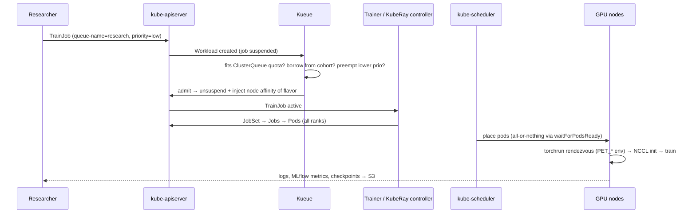
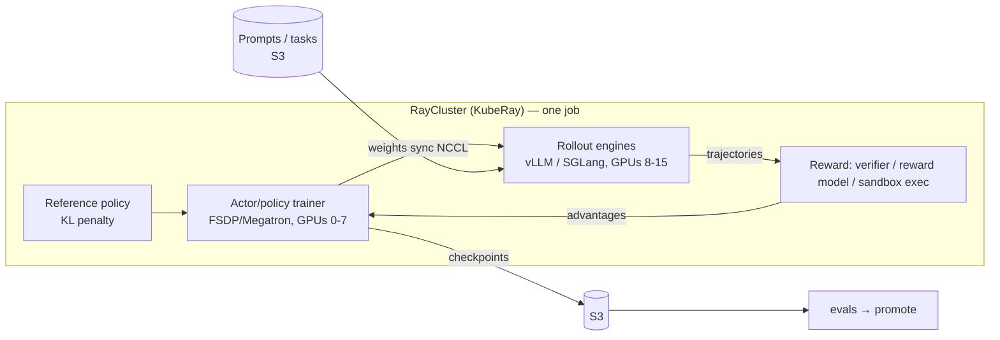

# 06 — Training deep dive

## 1. The three kinds of training a lab runs

| Kind | Scale | Shape | OSS here |
|---|---|---|---|
| **Pre-training** | 1k–100k GPUs, weeks | one giant synchronous job; throughput and fault tolerance dominate | (docs) torchtitan, Megatron-LM, DeepSpeed on TrainJob/JobSet |
| **Post-training: SFT / LoRA / DPO** | 1–64 GPUs, hours | many small jobs, sweeps | `training/05-jobs/trainjob-lora-finetune.yaml`, TRL, torchtune runtimes |
| **Post-training: RL** (RLHF, RL with verifiable rewards, agentic RL) | 8–1000s GPUs | **trainer + inference engines in one loop** | veRL / OpenRLHF / NeMo-RL / SkyRL on **KubeRay** |

## 2. Parallelism cheat sheet

```
             ┌───────────── one training step ─────────────┐
DP / FSDP    split the BATCH; FSDP also shards params/grads/optimizer state across ranks
TP           split each LAYER's matrices (intra-node, NVLink)
PP           split LAYERS into stages; micro-batches flow through (inter-node OK)
CP / SP      split the SEQUENCE (long context)
EP           split MoE EXPERTS
```

A large job composes them ("3D/4D/5D parallelism"). For example, on 1024
GPUs: TP=8 (within a node) × PP=4 × DP/FSDP=32. The rule of thumb is to put
the most communication-intensive dimension on the fastest links: TP on
NVLink, then PP/CP, with DP/FSDP spanning the network.

Memory per parameter for mixed-precision Adam ≈ 16–18 bytes (weights,
grads, two moments, master copy). A 7B full fine-tune needs ~120 GB before
activations, which is why **FSDP or ZeRO-3** (sharding) or **LoRA/QLoRA**
(train only small adapters) are needed even on modest hardware.

## 3. How a job flows through this platform



Kueue concepts in this lab (`platform/09-kueue/queues.yaml`):

* `training-cq` (4 GPUs nominal) and `batch-inference-cq` (2) share cohort
  `ai-lab`, so either can **borrow** the other's idle GPUs and **reclaim**
  them via preemption.
* `WorkloadPriorityClass` `high` / `low`: a high job preempts low ones in
  the same queue.
* Online vLLM Deployments are **not** in Kueue. They have a fixed
  reservation, and Kueue manages what's left.

## 4. Kubeflow Trainer versus KubeRay: when to use which

| Use Kubeflow **TrainJob** when… | Use **RayJob/RayCluster** when… |
|---|---|
| plain `torchrun` scripts (DDP/FSDP, Megatron, torchtitan, DeepSpeed) | your pipeline mixes data processing, training and inference (Ray Data + Train + vLLM) |
| you want a platform-owned runtime blueprint (`ClusterTrainingRuntime`) and a simple user-facing object | RL post-training: actors for trainer, rollout, reward model and reference model, with fine-grained GPU placement |
| MPI-style jobs | interactive dev (notebook connects to a `RayCluster`) and elastic or fault-tolerant actors |

Both are Kueue-aware.

## 5. RL post-training on Ray (how labs do RLHF / RLVR)



veRL, OpenRLHF, NeMo-RL and SkyRL implement this loop. The infra lesson is
that your inference stack (vLLM, KV caching) is **inside** your training
loop, and rollout throughput often dominates step time. Co-locating actors
versus separating pools is the central design trade-off.

## 6. Fault tolerance and checkpointing

* At scale, assume failures: GPU XID errors, NCCL timeouts, node reboots.
  Kueue `waitForPodsReady` plus JobSet/TrainJob restart policies rebuild the
  whole group. LWS does the same for multi-node inference.
* Checkpoint often and **asynchronously** (PyTorch DCP async save,
  torchtitan), to a parallel FS or S3. Measure checkpoint time as a fraction
  of the interval.
* Use DCGM exporter metrics and GPU Operator health checks to cordon bad
  nodes before the scheduler places a job on them. At hyperscale this is a
  dedicated automated "node health" system (docs/10).
* Elastic training (torchrun `--nnodes=min:max`, Ray Train) lets jobs
  survive a lost node without a full restart.

## 7. Data path

```
raw (S3) ─► Ray Data / Spark: filter, dedup, PII scrub, tokenize ─► shards (S3, e.g. MDS/webdataset/parquet)
         ─► streaming dataloader in trainers (local NVMe cache) ─► GPUs
```

Keep GPUs fed: data loading should never show up in step-time profiles.
Pre-tokenize, use large sequential shards, cache locally, and prefetch.

## 8. Experiment hygiene

* Every job logs to **MLflow**: git SHA, image digest, dataset version,
  hyperparameters, metrics and checkpoint URI.
* Evals run as Kueue `batch` jobs against the gateway
  (`evaluation/02-lm-eval`), with results logged next to the training run.
* Promotion means moving the gateway alias (`lab-chat` → new model or
  adapter) only after the eval gate passes. That is a one-line change in
  `ai-gateway-route.yaml`, and it's why aliases exist.
