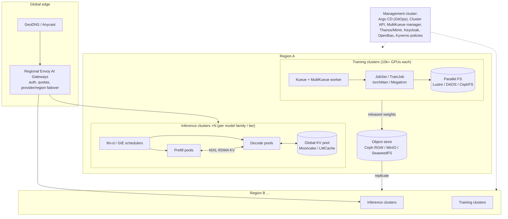

# 10 — From lab to hyperscale, with OSS only

This doc describes what changes when you go from 8 GPUs to 10,000–100,000+.
The building blocks in this repo stay. Topology, redundancy and a few extra
systems are added around them.

## 1. Reference topology

## 2. Compute and cluster topology

| Lab | Hyperscale (OSS) |
|---|---|
| 1 cluster | **many clusters** per region and purpose (training vs inference vs batch), lifecycle via **Cluster API** (bare metal: Metal3, Tinkerbell) |
| Manual `helm install` | **GitOps** with **Argo CD** (ApplicationSets per cluster) or Flux. This repo's folders map 1:1 to Argo Applications |
| kubeadm by hand | immutable node images (Talos, Flatcar, or Ubuntu with image pipelines) and automated provisioning |
| one Kueue | **MultiKueue**: a manager cluster dispatches jobs to worker clusters with capacity |
| node labels | **Topology-Aware Scheduling** (Kueue TAS) on rack, block and NVLink-domain labels, so a job's ranks land on the fewest network hops. Needed for GB200 NVL72 domains |
| device plugin | **DRA** with NVIDIA's DRA driver: ComputeDomains for multi-node NVLink (IMEX), fine-grained sharing |

Kubernetes control plane at scale: 5k–15k nodes per cluster has been shown
publicly (with etcd tuning, API priority and fairness, and fewer watches).
Most labs prefer **more, smaller clusters** for blast-radius reasons.

## 3. Networking

* **Training fabric**: a separate, rail-optimized, non-blocking fat-tree,
  either InfiniBand NDR/XDR or RoCEv2 Ethernet (Ultra Ethernet direction),
  400–800 Gb/s per GPU. Exposed to pods via NVIDIA Network Operator, SR-IOV
  and Multus. NCCL is tuned per topology. Cilium remains the front-end and
  pod network.
* **Front-end network**: Cilium with native routing over BGP to the
  top-of-rack switches (no overlay), Cilium **ClusterMesh** for cross-cluster
  services where needed, and eBPF host firewalling.
* **North-south**: anycast or GeoDNS → regional Envoy fleets (Envoy AI
  Gateway). Global rate limiting is backed by a sharded Redis/Valkey.

## 4. Storage and data

| Data | Hyperscale OSS |
|---|---|
| Training data and checkpoints (hot) | **Lustre**, **DAOS**, **CephFS**, or a high-throughput S3 with local NVMe caches (Alluxio, JuiceFS) |
| Object store (source of truth) | **Ceph RGW**, MinIO, SeaweedFS across failure domains with erasure coding |
| Checkpointing | async, sharded (PyTorch DCP), tiered: memory or local NVMe → PFS → S3 |
| Model distribution | P2P or streamed loading (Dragonfly or Kraken for images; Run:ai streamer and fastsafetensors for weights), pre-staging on node NVMe |
| Data processing | **Ray Data**, **Spark on k8s**, Daft. Dedup and filtering at petabyte scale |
| Lineage and catalog | Iceberg or Delta tables, a dataset catalog (Unity Catalog OSS, DataHub) |

## 5. Training at scale

* **Frameworks**: torchtitan (FSDP2 + TP + PP + CP, float8),
  Megatron-Core, DeepSpeed, or MaxText (JAX). 4D/5D parallelism with
  topology-aware rank placement.
* **Reliability engineering** (the real work at 10k+ GPUs):
  * pre-flight node validation (DCGM diagnostics, NCCL tests) before a node
    joins the pool
  * continuous health checks → automatic **cordon / drain / repair** (a
    node-problem-detector plus GPU health → remediation operator)
  * fast restarts: hot-spare nodes, in-memory checkpoint replicas, reduced
    NCCL init time
  * straggler detection (per-rank step-time telemetry)
* **Goodput** (useful training time divided by wall time) is the KPI,
  typically targeted above 90%.

## 6. Inference at scale

* **llm-d / Dynamo-style** disaggregated serving: separate prefill and decode
  pools, **wide expert parallelism** for MoE across many nodes, KV transfer
  over RDMA (NIXL), and a **global KV-cache index** so the scheduler routes to
  wherever the prefix lives.
* **Multi-tier KV**: HBM → DRAM → NVMe → distributed pool (Mooncake,
  LMCache). Cache-aware routing becomes the single biggest efficiency lever
  for agentic and long-context traffic.
* **Fleet autoscaling** at two levels: replicas per model (KEDA, or llm-d's
  variant autoscaler on SLOs) and GPUs per model family (moving capacity
  between models and between training and inference on a daily cycle).
* **Traffic management**: priority classes (interactive above batch above
  internal), load shedding, per-tenant token quotas, and region failover at
  the AI gateway.
* **Safe rollouts**: canary by weight in the gateway route, shadow traffic,
  automatic rollback on TTFT, error or eval regressions.
* **Batch tier**: offline APIs (Ray Data + vLLM) soak up idle GPUs at a
  discount and get preempted by Kueue when interactive load rises.

## 7. Observability at scale

Use Prometheus per cluster with **Thanos or Mimir** for global queries and
retention (or VictoriaMetrics), OpenTelemetry traces (Tempo or Jaeger), logs
in Loki or OpenSearch, plus per-GPU and per-job telemetry for goodput,
utilization and cost per token. SLOs are tracked with Sloth or Pyrra.

## 8. Security at scale

Add these on top of `security/`:

* Workload identity with **SPIFFE/SPIRE**.
* mTLS everywhere (Cilium mutual auth or Istio ambient, see docs/11).
* Policy as code in CI.
* Signed images **and signed models** (sigstore, OpenSSF model-signing)
  verified at admission.
* Confidential computing for weights where needed (H100/B200 CC mode, Kata
  with CoCo).
* Strict separation of the training data plane from the serving plane.
* Audit trails to WORM storage.

## 9. Mapping table: lab component → hyperscale role

| This repo | At hyperscale |
|---|---|
| Cilium | same, native routing + BGP, ClusterMesh |
| GPU Operator | same, plus Network Operator, DRA driver and a health-remediation system |
| Kueue | Kueue + MultiKueue + TAS + fair sharing |
| Kubeflow Trainer / JobSet | same, running torchtitan or Megatron |
| KubeRay | same, for data, RL and batch inference |
| Envoy AI Gateway | regional fleets, global rate-limit service |
| production-stack router / GIE | **llm-d** scheduler (GIE-based) with a global KV index |
| vLLM | same (or SGLang/TRT-LLM), P/D disaggregated, wide EP |
| LMCache | LMCache, Mooncake, NIXL in a global KV pool |
| KEDA | KEDA plus SLO-driven capacity planners |
| MinIO / NFS | Ceph / Lustre / DAOS + S3 |
| Prometheus | + Thanos or Mimir |
| `install.sh` | Argo CD ApplicationSets, Cluster API |

## 10. Suggested reading (public sources)

* Meta, "Building Meta's GenAI infrastructure" and the Llama 3 paper's
  infrastructure section (reliability at 16k GPUs).
* The DeepSeek-V3 technical report (FP8 training, DualPipe, EP) and the
  DeepSeek open-infra releases (3FS, DeepEP).
* The llm-d and vLLM blogs on P/D disaggregation and KV-cache-aware routing.
* Kubernetes WG Serving and WG Batch documents, the Kueue TAS and MultiKueue
  KEPs, and the Gateway API Inference Extension proposals.
* The Mooncake paper (Kimi's KV-centric architecture), the LMCache papers
  (CacheGen, CacheBlend), the vLLM PagedAttention paper and SGLang
  RadixAttention.
