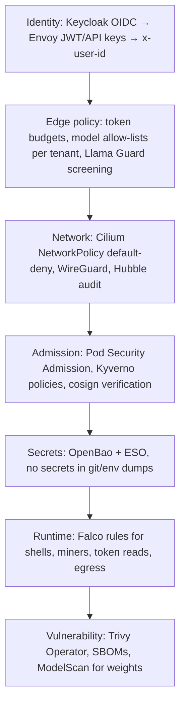

# 12 — Security for an AI platform (OSS only)

## Threat model (what's special about AI infra)

| Asset | Threats |
|---|---|
| **GPUs** | crypto-mining, quota abuse, noisy-neighbour DoS |
| **Model weights** (yours, fine-tunes) | exfiltration, tampering or backdooring, pickle-based code execution on load |
| **Prompts and outputs** (user data) | leakage through logs, KV-cache sharing across tenants, cross-tenant routing bugs |
| **Credentials** (HF tokens, provider API keys, S3 keys) | leakage through manifests, env dumps or images |
| **Supply chain** | malicious model repos (`--trust-remote-code`), vulnerable CUDA/Python images, poisoned datasets |
| **The model's behaviour** | jailbreaks, prompt injection (especially for agents with tools), harmful output |
| **Control plane** | over-privileged operators (GPU Operator and Falco are privileged by necessity), webhook bypass |

## Layers and the OSS for each

## Practical rules for this lab

1. **Only the gateway is exposed.** All model Services are ClusterIP. Apply
   `platform/00-cilium/netpol-llm-serving.yaml` once things work.
2. **Every request has an identity.** Start with API keys, move to Keycloak
   JWTs, and feed `x-user-id` into token budgets and logs.
3. **No secrets in git.** Use `hf-token-secret.example.yaml` as a template
   only, keep the real value in OpenBao and sync it with ESO. `.gitignore`
   blocks `*-secret.yaml`.
4. **Weights are code.** Prefer safetensors, avoid `--trust-remote-code`
   (Kyverno audits it), scan downloads with ModelScan, and pin model
   revisions (`--revision <sha>`), because a model repo can change under you.
5. **Multi-tenant KV caches.** Shared prefix or KV caches can, in principle,
   leak information through timing side channels. Isolate sensitive tenants
   on separate engine pools or cache namespaces.
6. **Privileged components are confined to their namespaces.**
   `gpu-operator`, `kube-system` (Cilium) and Falco need privileges.
   Workload namespaces enforce PSA `baseline` and warn on `restricted`.
7. **Don't log prompts** by default (`--disable-log-requests`). If you need
   them for evals or data, get consent, redact with Presidio and set a
   retention policy.
8. **Guardrails are layered.** Llama Guard on inputs and outputs, a
   system-prompt policy, and tool sandboxing for agents (gVisor or Kata for
   code execution).
9. **Patch cadence.** Trivy reports plus a monthly bump of `versions.env`
   and image tags. Watch CVEs in vLLM/Ray APIs, which have had RCE-class
   bugs. Never expose the Ray dashboard or job API without auth.

## Install order

See `security/README.md`. Everything starts in **audit** mode. Promote one
policy at a time to enforce after a quiet week of reports.
