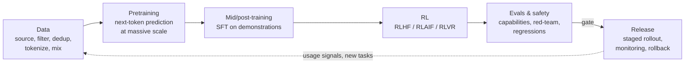

# 14 — Build your own model: the frontier-lab lifecycle at toy scale

The rest of this repo teaches the *platform*. This doc and
[`lifecycle/`](../lifecycle/README.md) teach what the platform is *for*:
taking raw data to a deployed, evaluated, RL-tuned model. You'll run every
stage a frontier lab runs, at roughly a millionth of the scale, on the same
kinds of OSS building blocks.

## Stage by stage

### 1. Data (`lifecycle/01-data-prep`)

**What you do:** stream ~100k web documents (fineweb-edu), drop exact
duplicates, apply heuristic quality filters, tokenize with GPT-2 BPE and
write token shards to S3 using Ray Data on KubeRay.

**What it teaches:** data pipelines are distributed batch jobs (map, filter,
groupby) whose output is a versioned artifact. Dedup and quality filtering
move model quality more than most architecture changes. Tokens are the unit
of account for everything that follows.

**At frontier scale:** tens of trillions of tokens from web crawls, code,
books, papers, licensed and synthetic sources. Fuzzy dedup (MinHash-LSH)
across petabytes, model-based quality classifiers, PII and toxicity
filtering, **decontamination** against eval sets, and **data mixtures**
(weights per source) tuned with small proxy models. Data teams are often as
large as modelling teams.

**Exercises**
* Add MinHash near-dedup (`datasketch`) and measure how many extra docs it removes.
* Add an n-gram decontamination pass against GSM8K test questions.
* Build two mixtures (web-only vs web + 20% code) and pretrain on each.
  Compare val loss on held-out code.

### 2. Pretraining (`lifecycle/02-pretrain`)

**What you do:** train a ~124M-param GPT-2-shaped model from scratch with
FSDP2 on 1–8 GPUs, with cosine LR, bf16, sharded DCP checkpoints to S3
(auto-resume), and MLflow logging of loss, tokens/s and **MFU**. Export to
HF format.

**What it teaches:**
* the training loop's anatomy (micro-batches, grad accumulation, clipping, schedules)
* sharding (FSDP) and why communication overlap matters
* **checkpoint and resume as a survival skill**: kill a pod mid-run and
  watch Kueue/Trainer restart it from the latest step
* MFU as the efficiency metric: are you buying GPUs or using them?

**Scaling laws in one paragraph:** loss falls predictably as a power law in
parameters (N), data (D) and compute (C ≈ 6·N·D FLOPs). **Chinchilla**
(Hoffmann et al., 2022) found compute-optimal training uses about **20
tokens per parameter**. For 124M params that's ≈ 2.5B tokens, or about
1.9 × 10¹⁸ FLOPs: under an hour on 8 A100s and ~5–8 hours on one (at 25–35% MFU). Modern
labs deliberately *over-train* smaller models far past Chinchilla (Llama 3
8B saw ~15T tokens, ~1,900 tokens/param) because inference cost, not
training cost, dominates over a model's lifetime. Labs fit scaling curves on
small runs, like the ones you'll do here, to predict big ones before
committing thousands of GPUs.

**At frontier scale:** 10k–100k+ GPUs for weeks to months. 4D/5D
parallelism (FSDP + TP + PP + CP + EP for MoE), FP8, custom kernels,
loss-spike detection and rollback, async checkpointing, automated node
health remediation, and goodput above 90% as an engineering KPI.

**Exercises**
* Run 1 GPU vs 4 GPUs at a fixed global batch. Compare tokens/s and MFU.
  Where does scaling efficiency drop?
* Train 3 sizes (`N_LAYER/N_EMBD` = 6/384, 8/512, 12/768) on the same tokens,
  plot final val loss against params, and fit a power law.
* Kill one rank mid-run. Measure time lost (restart + reload + recompute
  since the last checkpoint) and tune `CKPT_EVERY`.

### 3. SFT (`lifecycle/03-sft`)

**What you do:** fine-tune on chat conversations (UltraChat) with a chat
template and **assistant-only loss masking**. Do it either on your toy model
(mechanics) or on Qwen2.5-0.5B (useful results).

**What it teaches:** a base model becomes an assistant through format plus
behaviour imitation. The chat template is a contract between training and
serving. Loss masking decides *what* the model learns.

**At frontier scale:** large curated and synthetic instruction sets,
domain-specific mixtures (code, math, tool use, safety refusals and
non-refusals), careful deduplication against evals, and multiple SFT rounds
interleaved with RL.

**Exercises**
* Disable loss masking (labels = input_ids) and compare outputs. The model
  starts writing user turns.
* SFT the 0.5B *base* model vs the *Instruct* model and evaluate both on GSM8K.

### 4. RL (`lifecycle/04-rl-grpo`)

**What you do:** run veRL GRPO on GSM8K with a programmatic reward (answer
match). vLLM generates rollouts inside the training loop on KubeRay.

**What it teaches:** optimising for outcomes rather than imitation; the
actor/rollout/reference/reward architecture; and why inference performance
is a *training* concern (rollouts dominate step time). It also introduces
reward hacking. Watch for answer-format exploits.

**At frontier scale:** RLHF and **Constitutional AI / RLAIF** for
helpfulness and harmlessness, RL with verifiable rewards on math, code and
agentic tasks in sandboxes, thousands of GPUs split between trainers and
rollout fleets, and asynchronous off-policy pipelines. This is where much of
recent capability progress (reasoning models) comes from.

**Exercises**
* Vary `rollout.n` (2/4/8). What happens to reward variance and step time?
* Remove the KL loss. Does accuracy rise faster? Does output quality
  elsewhere degrade?
* Write a reward that only checks format. Watch the model hack it.

### 5. Evals and release (`lifecycle/05-eval-and-promote`)

**What you do:** sync a model version from S3, serve it as a `candidate`,
eval it against the current `lab-chat` baseline on the same task, and only
then move the gateway alias, either fully or as a weighted canary, with
one-command rollback.

**What it teaches:** evals as a **release gate**, not a dashboard;
model-version indirection (aliases); canaries and rollback for models,
exactly as for software.

**At frontier scale:** hundreds of capability, safety and regression evals
(many private to avoid contamination), dangerous-capability and red-team
evaluations under a responsible scaling policy, staged rollouts (internal →
trusted testers → GA), online metrics and abuse monitoring after launch.

**Exercises**
* Promote with `--canary 10`, then use the gateway's per-backend metrics to
  compare latency and error rates for the two backends.
* Make the gate multi-task (gsm8k + ifeval) and require no regression on
  either.

## Expected time and resources (rough)

| Stage (estimates from 6·N·D FLOPs at 25–35% MFU; measure yours) | 1× 24 GB GPU | 1× A100/H100 80 GB | 8× A100/H100 |
|---|---|---|---|
| 01 data (100k docs) | 20–60 min (CPU, network-bound) | same | same |
| 02 pretrain 2k steps × 65k tokens (130M tokens) | ~30–60 min (`MICRO_BS=8`) | ~15–25 min | a few min (raise `GRAD_ACCUM` instead) |
| 02 Chinchilla-optimal 124M (2.5B tokens) | ~10–15 h | ~5–8 h | ~40–60 min |
| 03 SFT 0.5B, 20k convs | ~1–2 h | ~30 min | – |
| 04 GRPO 0.5B GSM8K, 3 epochs | not recommended (needs 2+ GPUs) | ~2–4 h (2 GPUs) | ~1 h |
| 05 eval (200 examples × 2 models) | ~10–20 min | ~10 min | – |

Power and cost: a 700 W GPU running for 24 h uses ~17 kWh. Run the
whole track once on the mechanics path before scaling anything up.

## What this does *not* teach (honest gaps)

* **Scale-specific failure modes**: loss spikes, numerical instabilities,
  and hardware faults at 10k GPUs are qualitatively different. Read the Llama
  3 and OPT logbooks and the DeepSeek-V3 report.
* **Tokenizer training**, long-context extension, multimodal pretraining and
  MoE pretraining are all next steps with the same infrastructure.
* **Safety research** (interpretability, alignment evals) uses these same
  pipelines but is a field of its own.

## Where to go next

* Replace `pretrain.py` with **torchtitan** (Llama-architecture, FSDP2 + TP,
  float8) and repeat the scaling exercise.
* Replace the toy reward with a **sandboxed code-execution reward** (gVisor)
  for coding RL.
* Wire stages into an **Argo Workflows** DAG (data → pretrain → SFT → RL →
  eval → promote) triggered from git. That's your own mini release pipeline.
