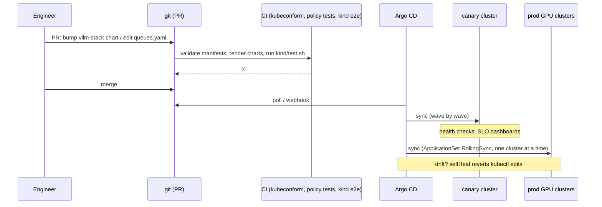
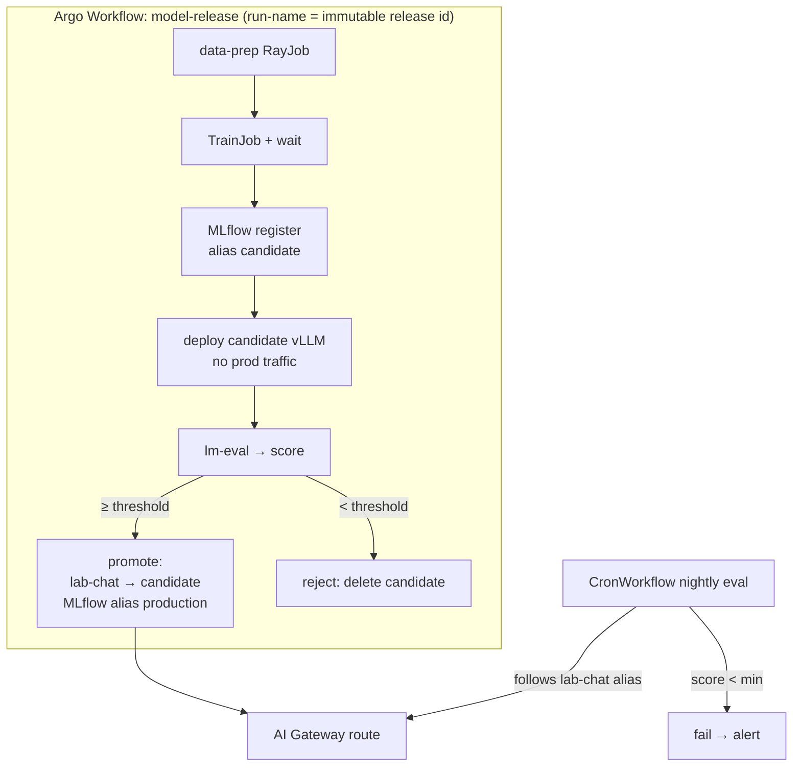

# 15 — GitOps and pipelines: shipping platform changes and models safely

A frontier lab changes two very different things all the time:

| | Platform changes | Model releases |
|---|---|---|
| Examples | bump vLLM, new Kueue quota, new Cilium policy, add a GPU cluster | new fine-tune, new checkpoint, new quantization, new alias target |
| Rate | daily | daily to hourly |
| Risk | outage across every model | quality regression, safety regression, outage of one model |
| Tool here | **Argo CD** (GitOps): `gitops/` | **Argo Workflows** (pipelines): `pipelines/` |
| Safety net | PR review, CI, canary cluster, `git revert` | eval gate, candidate deployment, alias flip, nightly regression |

Both follow the same principle: **no human runs `kubectl apply` against
production.** Humans change git or launch a parameterised pipeline, and
controllers do the rest, leaving an audit trail.

## 1. Platform changes with GitOps



Concepts to internalise (each is visible in `gitops/02-app-of-apps/apps/`):

* **App of apps**: one root Application creates one child per component.
  The whole platform is about 30 small files, not one giant chart.
* **Sync waves**: CNI → namespaces → operators → CRD consumers → workloads →
  routes. This is the same order as `docs/04`, now enforced by a machine.
* **Multi-source Applications**: upstream chart plus *your* values from git.
  The values files used by `install.sh` are reused unchanged.
* **Drift handling**: `selfHeal` reverts manual edits, and
  `ignoreDifferences` covers fields that *other controllers* legitimately
  own (KEDA-managed replicas, injected `caBundle`s).
* **ApplicationSets**: the same baseline stamped onto every cluster labelled
  `ai.lab/role=gpu-cluster`. This is how 1 cluster becomes 50.
* **Secrets stay out of git**: OpenBao + ESO, so the repo could be public.

## 2. Model releases with pipelines



Why each step exists:

* **Immutable run name.** Data prefix, TrainJob, MLflow run, adapter path,
  Deployment and LoRA name all derive from it, so you can trace exactly what
  serves `lab-chat` back to its data.
* **Candidate before promotion.** A new model runs next to production and is
  evaluated through the real serving stack (same vLLM version and flags),
  not a notebook.
* **Aliases.** Clients only know `lab-chat`. Promotion and rollback are a
  pointer flip (gateway `modelNameOverride` plus the MLflow `production`
  alias), not a redeploy of clients.
* **Nightly regression.** Quality can change without a training run (new
  vLLM version, quantization, sampling defaults), so the alias gets
  re-evaluated every night.

## 3. Where the two meet: who owns the alias?

The gateway route is declared in git (`gateway/03-ai-routes/ai-gateway-route.yaml`)
**and** patched by the pipeline's `promote` step. With Argo CD `selfHeal`
on, Argo CD reverts the pipeline's patch within minutes. That is a real
design decision, and labs pick one of two answers:

| Pattern | How | Trade-off |
|---|---|---|
| **Promotion = git commit** (pure GitOps) | `promote` opens or auto-merges a PR changing the alias target; Argo CD rolls it out | full audit trail and the same review path as platform changes; promotion latency = PR + sync time |
| **Pipeline owns the alias** | Argo CD `ignoreDifferences` on the route's `/spec/rules` (or move alias rules into a separate route object Argo CD doesn't manage) | fast, automatic; the source of truth for "what's live" is MLflow + cluster, not git |

A common hybrid: git owns *which backends exist and their capacity*, and
the release pipeline owns *the alias pointer*, recorded in the model
registry.

## 4. Exercises

**E1 — Self-heal.** Bootstrap Argo CD and the root app (on kind:
`kind/up.sh`, then `gitops/01-argocd/install.sh`, then
`kubectl apply -f gitops/02-app-of-apps/root-app.yaml`). Then:

```bash
kubectl -n kueue-system get clusterqueue training-cq -o yaml | grep -A2 nvidia
kubectl patch clusterqueue training-cq --type=json \
  -p '[{"op":"replace","path":"/spec/resourceGroups/0/flavors/0/resources/2/nominalQuota","value":99}]'
kubectl -n argocd get application kueue-queues -w     # OutOfSync → Synced; quota back to 4
```

Then make the *same* change via a commit to `platform/09-kueue/queues.yaml`
and watch it stick. *Q: How long until Argo CD reverted it? Where is that
interval configured?*

**E2 — Break it in git.** Commit an invalid value (e.g. a typo in a
Kyverno policy field) to a branch, point a test Application at that
branch, and watch the sync fail with a clear error and no partial apply.
Then `git revert`. *Q: Which CI check would have caught it before merge?*

**E3 — Run a release.** Run the release twice: once with a threshold
that passes and once with `-p threshold=0.99` so it's rejected.

```bash
kubectl apply -f pipelines/02-model-release-pipeline/
argo submit -n training --from workflowtemplate/model-release -p run-name=gsm8k-lora-v1 --watch
curl $GW/v1/chat/completions -H 'x-api-key: …' -d '{"model":"lab-chat", …}'   # served by v1
argo submit -n training --from workflowtemplate/model-release -p run-name=gsm8k-lora-v2 -p threshold=0.99 --watch
```

*Q: Which objects remain after the rejected run? What does MLflow show for
v1 and v2?*

**E4 — Ownership conflict.** With Argo CD managing `ai-routes`, run a
successful release and watch `lab-chat` get reverted. Fix it with each
pattern from §3. *Q: Which would you choose for a 50-cluster fleet, and
why?*

**E5 — Second cluster via ApplicationSet.**

```bash
kind create cluster --name ai-lab-2 --config kind/kind-config.yaml   # edit name first, or copy the file
# (install Cilium on it: API_SERVER_IP=ai-lab-2-control-plane CILIUM_VALUES=kind/cilium-values-kind.yaml platform/00-cilium/install.sh)
kind get kubeconfig --internal --name ai-lab-2 > /tmp/ai-lab-2.kubeconfig
argocd cluster add kind-ai-lab-2 --kubeconfig /tmp/ai-lab-2.kubeconfig \
  --name gpu-b --label ai.lab/role=gpu-cluster
kubectl apply -f gitops/02-app-of-apps/applicationset-gpu-clusters.yaml
kubectl -n argocd get applications -l cluster=gpu-b
```

*Q: Add an `env: canary` label to one cluster and enable RollingSync. In
what order do changes roll out now?*

**E6 — Nightly regression.** Trigger the CronWorkflow
(`argo cron trigger -n training nightly-lab-chat-eval`), then degrade
serving deliberately (e.g. patch the candidate to `--max-model-len=512` so
gsm8k prompts get truncated) and trigger again. *Q: Did the check fail? How
would you route that failure to on-call (Alertmanager, Slack, Argo Events)?*

## 5. At hyperscale

* **Repos**: one platform repo plus per-team model repos. Renovate opens
  version-bump PRs, and promotion between environments happens by
  directories/overlays or branches.
* **Argo CD**: HA, controller sharding (thousands of Applications), one
  management plane per region, SSO with RBAC per project.
* **Pipelines**: event-driven (Argo Events: new data lands in S3 → data
  pipeline; new checkpoint → eval pipeline), with caching and artifact
  lineage (or Flyte/Kubeflow Pipelines/Dagster). Large eval suites fan out
  across GPUs through Kueue.
* **Release safety**: canary by traffic weight in the gateway (1% → 10% →
  100%) with automatic rollback on TTFT, error or online-eval regressions,
  plus safety evals and human sign-off as mandatory gates for
  frontier-capability models.
