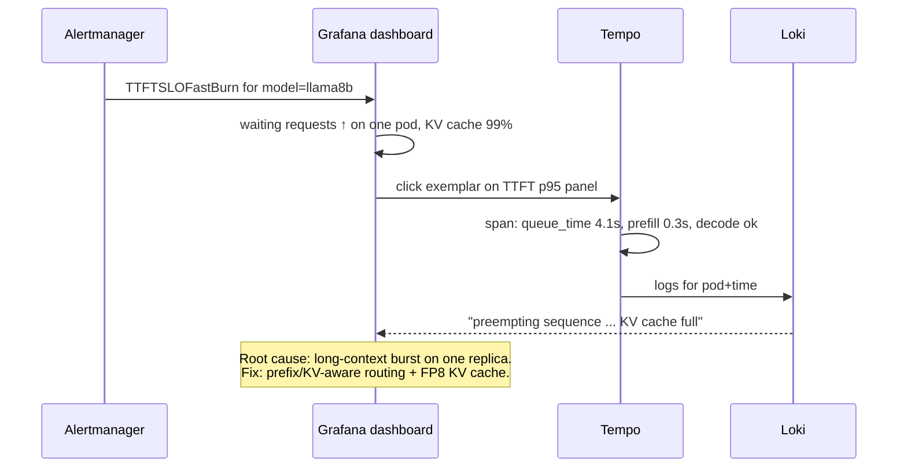

# 16 — Advanced observability: from dashboards to answers

[docs/08](08-observability.md) lists the signals. This doc explains how to
*use* them together. That is the skill that separates operating a GPU
fleet from merely running one. The material lives in
[`observability/`](../observability/README.md).

## 1. The four pillars, wired together

| Pillar | Tool | Question it answers | Cardinality / cost |
|---|---|---|---|
| Metrics | Prometheus | "Is something wrong, and where?" | cheap, aggregated |
| Traces | OTel Collector → Tempo | "Why was *this* request slow?" | sampled |
| Logs | Alloy → Loki | "What exactly happened on that pod?" | medium (label-indexed) |
| Cost | OpenCost + recording rules | "Was it worth it?" | cheap |

The workflow is a funnel: **alert (metrics) → dashboard (metrics) →
exemplar → trace → logs for that span → fix → cost impact**.

## 2. Designing metrics for LLM serving

**The serving RED method:**

* **Rate**: requests/s, *and tokens/s* (prompt and generation separately,
  because they cost very different amounts).
* **Errors**: 4xx (client/auth/quota), 5xx (engine), and *aborted streams*.
* **Duration**: TTFT, ITL/TPOT and e2e. Never just "latency", because a
  2,000-token answer is supposed to take longer.

**Saturation** (USE) for the engine is `num_requests_waiting`, KV-cache
usage and preemptions. GPU utilisation is **not** a saturation signal for
serving: a decode-bound engine can show 100% "util" while having headroom,
or 40% while queueing.

**Tensor-active vs util**: `DCGM_FI_DEV_GPU_UTIL` means "a kernel was
running". `DCGM_FI_PROF_PIPE_TENSOR_ACTIVE` is how busy the tensor cores
are. For training, compute **MFU** (model FLOPs utilisation) from tokens/s:
`MFU = tokens/s × 6 × params / (num_gpus × peak_flops)`. 40–55% is good for
dense LLMs.

## 3. SLOs and error budgets

An SLO turns "it feels slow" into arithmetic.

* **SLI**: the fraction of requests with TTFT ≤ 2.5 s.
* **SLO**: 95% over 30 days. **Error budget**: 5% of requests may be
  slower, which is ~36 hours of total badness per month.
* **Burn rate**: how fast you consume the budget. At burn 1 the budget
  lasts exactly 30 days. At burn 14.4 you lose 2% of the monthly budget per
  hour, which is page-worthy.

`observability/02-alerts/rules-serving-slo.yaml` implements the
multi-window, multi-burn-rate pattern with recording rules. Pick SLOs per
**model tier**: interactive chat might use TTFT p95 ≤ 1 s, batch ≤ 60 s,
embeddings e2e ≤ 200 ms.

Use the error budget for decisions: if a model has budget left, ship the
risky optimization (new quantization, new vLLM version). If it's exhausted,
freeze changes and spend effort on capacity and reliability.

## 4. Tracing LLM requests

What a good LLM trace contains, following the OpenTelemetry **gen_ai**
semantic conventions:

* Gateway span: route, backend, `x-ai-eg-model`, user id, token counts.
* Engine span: `gen_ai.request.model`, `gen_ai.usage.input_tokens` /
  `output_tokens`, queue time, time to first token, e2e.
* Your app's spans around it: retrieval (RAG), tool calls and guardrail
  checks. This is where agent latency actually goes.

Sampling: trace 100% in the lab. At scale, use **tail sampling** in the
collector (keep errors, keep slow requests, and a small random percentage
of everything else). `otel-collector-values.yaml` has the policy, ready to
enable.

## 5. Logs without leaking users' data

Logs are where prompt leaks happen. The rules in this repo:
`--disable-log-requests` on vLLM, an Alloy pipeline that drops anything
resembling a chat payload, Loki retention of 7 days, and access to Loki
treated like access to production data.

## 6. Cost as an engineering metric

`$ per 1M tokens` per model is **the** north-star metric for an inference
platform. It folds together utilisation (idle replicas), efficiency (batch
size, quantization, cache hit rate) and hardware choice. Track it next to
latency SLOs: an optimization that improves cost but burns the error
budget is a trade-off, not a win.

## Exercises

1. **Install the stack**: `observability/01-dashboards`, `02-alerts`,
   `04-logs`, `03-tracing`, `05-cost`. Confirm the Tempo and Loki
   datasources appear in Grafana.
2. **Trace a slow request.** Run `bench-shared-prefix` with prefix caching
   off. Find a slow TTFT exemplar, open the trace and attribute the time.
   Turn caching on and repeat.
3. **Trigger the SLO alert on purpose.** Scale a model to 1 replica, set
   `--max-num-seqs 4` and run `bench-random` at concurrency 64. Watch the
   burn rate climb. How long until `TTFTSLOFastBurn` fires? Is that fast
   enough?
4. **Cost experiment.** Record `$ per 1M output tokens` for an 8B model in
   bf16 with `max-num-seqs` 32, then FP8 with 256, at the same offered load.
   Explain the difference.
5. **Find the waste.** Use the GPU Fleet dashboard and the
   `GPUAllocatedButIdle` alert to list every GPU-hour wasted in a day. What
   would scale-to-zero or Kueue-managed batch soak-up recover?
6. **Write a dashboard panel** in `gen-dashboards.py` for "prefill vs
   decode token ratio per model", and explain why it predicts whether P/D
   disaggregation would help.
