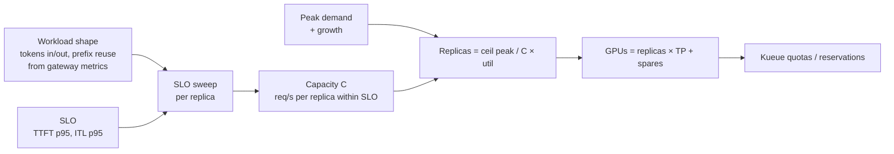
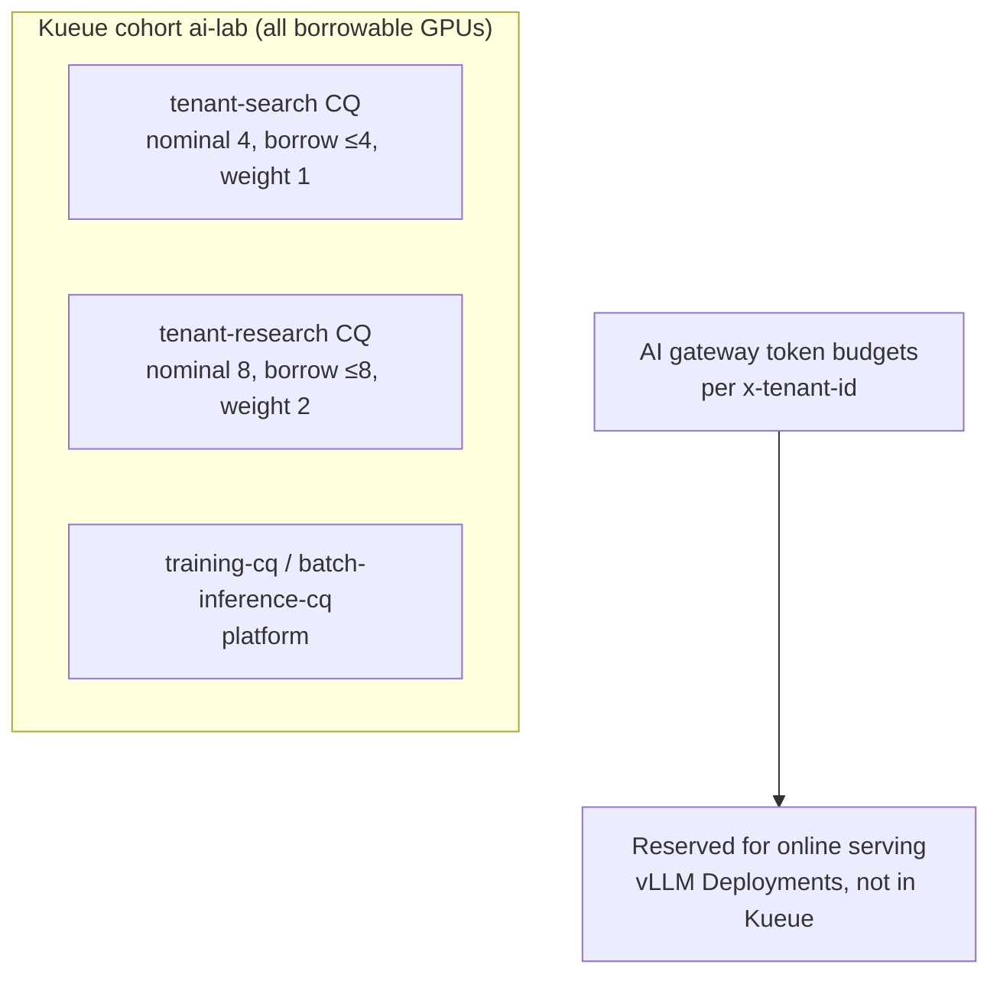

# 18 — Capacity planning and multi-tenancy

Once the platform runs, the hard questions are economic. *How many GPUs do
we need? Who gets them? What happens when everyone wants them at 10:00?*
This doc connects `evaluation/03-slo-sweep` and `tenancy/` into one way of
thinking.

## 1. From SLO to GPUs



1. **Characterise the workload.** Use the gateway's token metrics (input
   and output tokens per request, per model) and prefix reuse (the vLLM
   prefix cache hit rate). A chat assistant, a RAG system and a coding agent
   produce wildly different shapes.
2. **Define SLOs per product tier**: interactive chat (TTFT p95 < 1 s, ITL
   p95 < 50 ms), agents (looser TTFT, bigger contexts), batch (throughput
   only, no latency SLO).
3. **Sweep one replica** (`evaluation/03-slo-sweep/guidellm-sweep-job.yaml`)
   with that shape and find **C**.
4. **Size the fleet**: replicas = ⌈peak / (C × 0.7)⌉ + spares. The 0.7
   covers bursts *and* the minutes-long cold start of a new replica.
5. **Turn it into policy**:
   - KEDA thresholds (scale before a replica exceeds C × 0.7)
   - reserved GPUs for online serving (outside Kueue)
   - Kueue quotas for the rest

### Exercise 18.1 — your first capacity table
Run `analyze_capacity.py` on `sample-results.csv` (illustrative numbers),
then sweep your own `inference/02-vllm-basic` replica and compare. Change
one variable at a time and re-sweep: FP8 KV, `--max-num-seqs`, prefix
caching, and the SGLang engine (`inference/08-sglang`). *Q: which change
moves C the most for your workload?*

### Exercise 18.2 — SLO sensitivity
Re-run the analysis with ITL p95 targets of 30, 50 and 80 ms. *Q: how many
GPUs does a 20 ms tighter ITL SLO cost? This is the latency vs cost
conversation you'll have with product teams.*

### Exercise 18.3 — cost per million tokens
For two GPU types (or two quantizations), compute
`($/GPU-hour × GPUs) / (output tokens per hour at planned load)`. *Q: does
the faster GPU win on cost per token?*

## 2. Sharing GPUs between teams

The cluster is shared by **online serving** (latency SLOs, fixed
reservation), **tenants' training and batch jobs** (through Kueue) and
**platform jobs** (evals, benchmarks).



* **Nominal quota** is guaranteed to the tenant: borrowed GPUs are reclaimed
  for them by preemption.
* **Borrowing** means idle GPUs never sit idle. Low-priority work soaks them
  up and yields when the owner returns.
* **Fair sharing** (weights) decides who gets borrowed capacity when several
  tenants want it at once.
* The **ResourceQuota** is a hard backstop in case someone bypasses Kueue.
* **Token budgets** at the gateway are the serving-side equivalent of a GPU
  quota for shared model servers.

### Exercise 18.4 — onboard two tenants and fight
On kind (fake GPUs) or the lab:

```bash
cd tenancy/01-onboard-tenant
TENANT=alpha GPU_QUOTA=2 ./onboard-tenant.sh
TENANT=beta  GPU_QUOTA=2 FAIR_WEIGHT=2 ./onboard-tenant.sh
```

Submit 4-GPU jobs (copy `kind/manifests/kueue-demo.yaml`, set
`namespace: tenant-alpha` and `queue-name: default`) from both tenants.
*Q: who borrows? What happens to alpha's borrowed GPUs when beta submits?
Enable `fairSharing` in Kueue's config and repeat: does the weight change the
split?*

### Exercise 18.5 — isolation checks
From a pod in `tenant-alpha`: try to reach a pod in `tenant-beta`, a vLLM
pod in `llm-serving` directly (the policy should drop it) and the AI gateway
(it should work). Watch drops with `hubble observe --verdict DROPPED -n
tenant-alpha`. *Q: which rule allowed each successful flow?*

### Exercise 18.6 — noisy neighbour on a shared model server
Give tenant alpha a tiny token budget and have it send 30k-token prompts
while tenant beta sends short chats to the same model. *Q: how did beta's
TTFT change before and after alpha hit its budget? What would protect beta
without budgets?* (Think priority classes in GIE `InferenceObjective`,
separate pools and max prompt length policies.)

## 3. Checklist for a new tenant

- [ ] SLO tier and expected peak load agreed. Capacity math done.
- [ ] `onboard-tenant.sh` run, with quota, borrowing and fair-share weight
      chosen deliberately.
- [ ] Keycloak group `tenant-<name>` and a `tenant` claim mapper created.
- [ ] Gateway: models allowed for the tenant, token budget, API key or JWT.
- [ ] Hard or soft isolation decided (dedicated nodes? separate KV caches?).
- [ ] Dashboards filtered by `ai.lab/tenant` and by `x-tenant-id` token
      usage, for chargeback.
