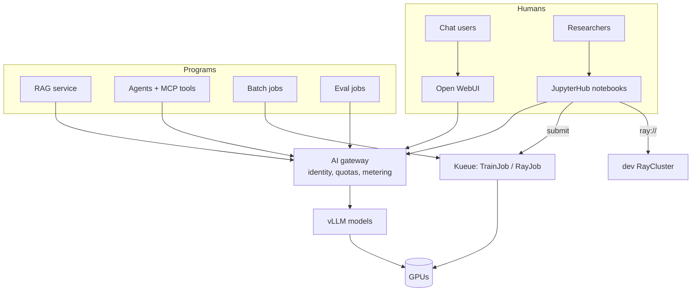

# 20 — Apps and the researcher workbench: using the platform

A platform you only `kubectl apply` to stays abstract. This chapter puts
**users** on it: people chatting, a RAG service, an agent with tools,
offline batch jobs, and researchers in notebooks. Each one stresses a
different part of the stack, so each is a lesson.

## 1. Who uses a frontier lab's platform?



| Workload | Shape | Platform features it exercises |
|---|---|---|
| Chat (Open WebUI) | bursty, interactive, streaming, long histories | TTFT, session/prefix routing, auth for humans |
| RAG | 3 model types per question (embed, rerank, chat) | multi-model routing, embedding throughput, long prompts → prefix caching |
| Agents | many sequential calls with growing context and tools | tool-call parsing, KV reuse, least-privilege tool access |
| Batch | huge, latency-insensitive | Kueue priorities, max-throughput engine settings |
| Notebooks | long-lived, mostly idle, sometimes holding a GPU | culling, quotas, identity |

## 2. Lab: a chat UI for the lab (apps/01-open-webui)

Install it, log in, and chat with `lab-chat`. Then:

1. Watch `vllm:num_requests_running` while you chat. A human produces very
   little load.
2. **The auth mismatch.** Open WebUI sends `Authorization: Bearer`; our
   gateway expects `x-api-key`. Read the three fixes in the README and
   implement the JWT one with Keycloak. This is the real-world problem of
   "every client speaks a slightly different auth dialect".
3. Enable `ENABLE_FORWARD_USER_INFO_HEADERS` and make the token rate-limit
   key off `X-OpenWebUI-User-Id`. Now quotas apply per human, not per UI.

## 3. Lab: RAG over the lab's own docs (apps/02, apps/03)

```
docs/*.md ─chunk─► bge-m3 embeddings ─► Qdrant
question ─► embed ─► top-20 ─► reranker top-5 ─► lab-chat with citations
```

Exercises:

* **Retrieval quality:** use `/search` to inspect what's retrieved for
  "How does LMCache share KV across replicas?". Compare with and without the
  reranker. The reranker usually fixes the "right document, wrong chunk"
  problem.
* **Chunking:** try 400, 1200 and 3000 characters. Small chunks retrieve
  precisely but lose context; big ones waste tokens.
* **Cost:** log `usage` from `/ask`. Most tokens are context, not question
  or answer. That's why prefix caching and LMCache matter for RAG: keep the
  system prompt first and stable.
* **Freshness:** edit a doc, re-run the ingest Job, and ask again.
  Deterministic chunk IDs make re-ingest idempotent.

## 4. Lab: an SRE agent (apps/04-agent-mcp)

The agent answers questions like "is anything queueing?" by calling
`query_prometheus`, `list_pods` and `search_docs` over **MCP**.

Exercises:

* Turn on tool calling for a 7B model (`--enable-auto-tool-choice
  --tool-call-parser hermes`). Then try the 1.5B model and see how tool-use
  reliability changes with model size.
* Count the requests and tokens per agent task in the gateway metrics.
  Compare with a single chat turn. Agents are **10–100× heavier**.
* Security: the MCP server's ServiceAccount can only list pods. Try asking
  the agent to delete something. Then think about which tools would need
  human approval, and where in the loop (agent, MCP server or gateway) that
  check belongs.

## 5. Lab: offline batch (apps/05-batch-api)

Run `vllm run-batch` on 2,000 classification prompts under Kueue's `batch`
queue.

* Compare tokens/s/GPU against the same prompts sent through the gateway.
* Preempt it with a high-priority TrainJob. Design resumability: shard the
  input and skip completed `custom_id`s.
* Compare with Ray Data batch (`training/05-jobs/rayjob-batch-inference.yaml`)
  when you have more than one GPU.

## 6. Lab: the researcher workbench (workbench/01-jupyterhub)

Researchers start in notebooks, then graduate to jobs:

```
notebook (1 GPU, interactive)  →  ray.init("ray://...") on the dev RayCluster
                               →  TrainJob/RayJob via Kueue for real runs
                               →  MLflow for tracking   →  gateway for evals
```

Exercises:

* From a notebook, call the gateway with the OpenAI SDK, log a run to
  MLflow, and connect to the dev RayCluster (Ray versions must match).
* Leave a GPU notebook idle and confirm the culler stops it after an hour.
* Make GPU notebooks go through Kueue (pod integration plus a queue label),
  so notebooks and jobs compete fairly for the same quota.

## 7. What you should take away

* Different workload shapes need different platform features. Design the
  platform from the workloads backwards.
* The **gateway is the contract**: identity, quotas, metering and model
  aliases make every app portable across model upgrades.
* Tools and agents move the security boundary into the application layer:
  apply least privilege to tools just like to pods.
