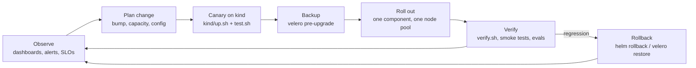

# 21 — Day-2 operations and multi-cluster

Installing a platform is day 1. Labs spend most of their time on
**day 2**: upgrades, backups, cold starts, capacity, and eventually more
than one cluster. This chapter turns those into exercises.

## 1. The day-2 loop



## 2. Backups (ops/01-backup-velero)

The key decision is **what not to back up**. Model weights are huge and
re-downloadable, and checkpoints and datasets already live in S3. Velero
protects the things that are small and painful to rebuild: routes, queues,
policies, Secrets, MLflow, Keycloak, OpenBao and Qdrant state.

Exercises:

1. Install Velero and run the nightly schedule manually.
2. **Restore drill:** delete the `lab-models` AIGatewayRoute and restore
   only that resource. Time it.
3. Delete the whole `mlops` namespace in kind and restore it (PVC contents
   included via file-system backup). Does MLflow come back with its
   experiments?
4. Write down your RPO (24h for nightly) and RTO (whatever you measured).
   Are they acceptable for each component?

## 3. Cold starts (ops/02-image-prepull)

The time from "scale to 2 replicas" to "second replica serving" is:

```
schedule ─► image pull ─► weights load ─► CUDA graphs/warmup ─► Ready
  ~1s        10s–5min        5s–5min          10–60s
```

Exercises:

1. Measure each phase for `vllm-qwen-7b` on a node that has never run it
   (pod events plus vLLM logs).
2. Apply the pre-pull DaemonSet and measure again.
3. Move weights from NFS to node-local NVMe (or `--load-format
   runai_streamer` from S3) and measure again.
4. With your numbers, compute how early KEDA must react to a traffic ramp.
   That's your scale-up lead time.

## 4. Upgrades (ops/03-upgrades)

Practise on kind:

1. Bump **one** chart in `versions.env` (e.g. KEDA), canary on kind, then roll out.
2. Do a "hard" one: Envoy Gateway + AI Gateway together. Read both release
   notes and find the CRD field changes before applying.
3. Bump the vLLM image and update the KEDA queries and dashboards for renamed
   metrics *in the same change*.
4. Simulate a Kubernetes node upgrade: drain a GPU node that's running an
   LWS group and a Kueue job. Note what restarts, and fix it with PDBs and
   checkpoints.

## 5. Capacity management

Questions to answer weekly in a real lab:

* GPU **allocation** vs **utilisation**: allocated-but-idle GPUs
  (`DCGM_FI_DEV_GPU_UTIL < 5` on pods holding GPUs) are the biggest waste.
* Queue wait time per Kueue ClusterQueue: is a team starved?
* Tokens/s per GPU per model: which models deserve more replicas, smaller
  quantization, or retirement?
* Headroom: can you absorb losing one GPU node without breaching SLOs?

Exercise: build a single Grafana dashboard "GPU economics" that answers all
four questions.

## 6. Multi-cluster (multicluster/)

### Why

* **Blast radius:** a bad CNI or Kueue upgrade takes down one cluster, not the lab.
* **Scale limits:** etcd and API server load grow with nodes, pods and watches.
* **Geography and capacity:** GPUs are where you can get them.
* **Separation:** training clusters are tuned for throughput, inference
  clusters for latency and availability.

### Hands-on: MultiKueue (multicluster/01-multikueue-kind)

1. `./up.sh`, then submit `demo-job.yaml` to the manager. Pods appear on the worker.
2. Add a second worker cluster (copy the worker steps) and submit several
   jobs. Watch the dispatch.
3. Fill the worker's quota. What happens to new jobs on the manager?
4. Delete the worker's Kueue deployment mid-run. How does the manager react?
5. Replace the admin kubeconfig with a least-privilege ServiceAccount
   kubeconfig (see the Kueue MultiKueue docs).

### Concepts: Cilium ClusterMesh

Read `multicluster/README.md`, then design a setup with:

* two inference clusters with the same models
* a gateway in each, with `service.cilium.io/global: "true"` plus
  `affinity: local` on model Services
* failure test: scale one cluster's model to 0 and confirm traffic fails
  over to the other cluster

### Fleet management at scale

| Concern | OSS |
|---|---|
| Create, upgrade and delete clusters | Cluster API (+ Metal3 / Tinkerbell for bare metal) |
| Same platform on every cluster | Argo CD ApplicationSets (cluster generator) over this repo's folders |
| Policy everywhere | Kyverno policies shipped by GitOps |
| Global view | Thanos or Mimir over per-cluster Prometheus |
| Job placement across clusters | MultiKueue |
| Cross-cluster networking | Cilium ClusterMesh |

## 7. Takeaways

* Reliability comes from **rehearsed** procedures (restore drills, canary
  upgrades), not from components.
* Cold-start time is a platform property. Measure it, then engineer it down.
* Multi-cluster solves blast radius and scale but adds a control layer
  (MultiKueue, ClusterMesh, GitOps). Adopt it when one cluster really hurts,
  not before.
