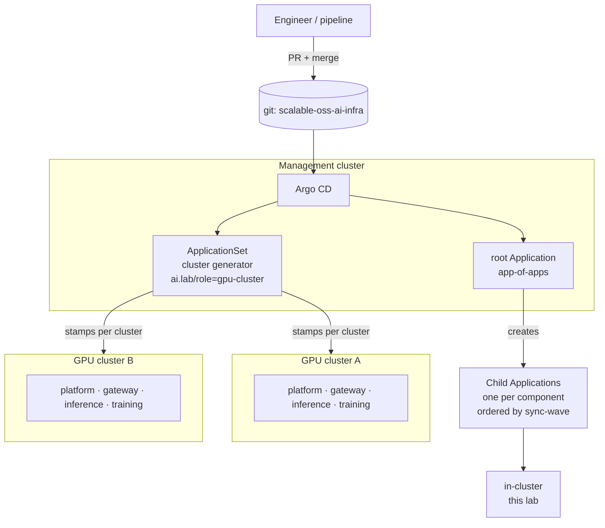

# GitOps — run the platform from git with Argo CD

Up to now every component was installed by a human running `install.sh`.
That's the right way to *learn* a component, and the wrong way to *operate*
a fleet. Every serious AI platform (and every hyperscaler-sized one) runs
on **GitOps**:

* **Git is the source of truth.** The desired state of every cluster
  (charts, versions, values, queues, routes) lives in this repo.
* **A controller reconciles.** Argo CD continuously compares git with each
  cluster and fixes drift (`selfHeal`). A `kubectl edit` at 3 a.m. gets
  reverted unless it's committed.
* **Changes are PRs.** Reviews, CI checks (`kubeconform`, policy tests),
  audit trail, and a one-click `git revert` rollback.
* **One repo → N clusters.** ApplicationSets stamp the same platform onto
  every GPU cluster, which is how you go from 1 lab cluster to 50.

## Ordering with sync waves

Kubernetes is eventually consistent, but some things really must come first:
a CNI before any pod, operators before the custom resources they serve.
Each child Application carries `argocd.argoproj.io/sync-wave`. The root app
syncs waves in ascending order and waits for each wave to be **Healthy**
before starting the next.

| Wave | What | Why it must precede the next |
|---|---|---|
| -20 | `AppProject ai-lab` | children reference it |
| -10 | Cilium | no pod networking without a CNI |
| -9 | namespaces (+ Pod Security labels) | everything else lands in them |
| -8 | cert-manager, NFS storage | webhooks need certs; PVCs need a StorageClass |
| -7 | NVIDIA GPU Operator | `nvidia.com/gpu` must exist before GPU pods schedule |
| -6 | kube-prometheus-stack | ServiceMonitor/PodMonitor CRDs used by later charts |
| -5 | KEDA, LWS, Kueue | operators + CRDs |
| -4 | Kueue queues, security (OpenBao, ESO, Kyverno, Falco, Trivy, Keycloak) | CRD *consumers* after their operators |
| -3/-2 | Envoy Gateway, AI Gateway CRDs + controller | Gateway API plumbing |
| -1 | `Gateway`, auth policy | the entry point |
| 0 | model cache, vLLM stack, MinIO, MLflow, KubeRay, Trainer, Argo Workflows | workloads |
| 1 | AI routes, training runtimes, pipeline templates | consume workloads/CRDs from wave 0 |

> Waves between *Applications* only work if Argo CD knows how to assess
> the health of an `Application` resource. That check was removed from Argo
> CD's defaults in v1.8. `01-argocd/values.yaml` adds it back. Without it, all
> waves sync at once.

## Folders

| Folder | |
|---|---|
| [`01-argocd`](01-argocd/) | install Argo CD with the settings an AI platform needs (OCI Helm repos, CRD drift rules, Application health) |
| [`02-app-of-apps`](02-app-of-apps/) | root Application + one child Application per component + a multi-cluster ApplicationSet example |

See [docs/15-gitops-and-pipelines.md](../docs/15-gitops-and-pipelines.md) for the
narrative and exercises.

## Chicken-and-egg: Cilium

Argo CD runs in pods, and pods need a CNI. So bootstrap is:

1. Install Cilium by hand (`platform/00-cilium/install.sh`).
2. Install Argo CD (`01-argocd/install.sh`).
3. Apply the root app. The Cilium Application *adopts* the existing Helm
   release (same release name `cilium`, same namespace), and from then on
   upgrades go through git.
