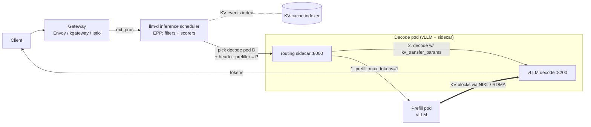

# llm-d — Kubernetes-native distributed inference

[llm-d](https://github.com/llm-d/llm-d) (Red Hat, Google, IBM, NVIDIA,
CoreWeave and others) is what you get when you take the pieces this repo
wires by hand and turn them into a production stack:

| llm-d piece | Built on | You already met it in |
|---|---|---|
| **Inference scheduler** | Gateway API Inference Extension **EPP**, with pluggable *filters* and *scorers*: prefix-cache, KV-cache utilisation, queue depth, LoRA affinity, P/D role | `gateway/04-inference-extension` |
| **KV-cache indexer** | vLLM KV events → global index of which pod holds which prefix blocks (precise prefix-cache-aware routing instead of estimates) | `inference/04` `kvaware` routing |
| **P/D disaggregation** | separate prefill and decode vLLM pools; KV moved by **NIXL** (UCX/RDMA) through vLLM's `NixlConnector` | `inference/03-lmcache` (KV transfer idea) |
| **Wide expert parallelism** | DeepSeek-style MoE spread over many GPUs/nodes with LWS, DP-attention + EP experts, DeepEP kernels | `inference/05-model-catalog/llm-multinode-lws.yaml`, `moe-expert-parallel.yaml` |
| **Variant autoscaler** | SLO/saturation-driven scaling across model "variants" (e.g. different GPU types) | `inference/06-autoscaling` (KEDA) |
| **Routing sidecar** | runs on decode pods; orchestrates "prefill remotely first, then decode here" | – (new) |



How a P/D request flows:

1. The scheduler picks **both** a decode pod and a prefill pod. It forwards
   the request to the decode pod with a header naming the prefiller.
2. The decode pod's **sidecar** sends the prompt to the prefiller with
   `max_tokens=1` and `kv_transfer_params` (`do_remote_decode`). The
   prefiller computes the KV.
3. The sidecar then sends the request to its local vLLM along with the
   returned `kv_transfer_params`. vLLM **pulls the KV blocks over NIXL**,
   skips prefill and decodes.

## Two ways to learn it

### A. Use the upstream "well-lit paths" (recommended)

`install.sh` clones llm-d at a pinned tag and walks you to its guides
(each one is a `helmfile` deploying gateway, scheduler and model servers):

| Guide | Teaches |
|---|---|
| `inference-scheduling` | EPP scorers (prefix/KV/load-aware) vs round-robin, on aggregated vLLM |
| `pd-disaggregation` | prefill/decode split with NIXL + routing sidecar |
| `wide-ep-lws` | DeepSeek-class MoE with wide EP over LWS (needs many GPUs + RDMA) |

```bash
LLMD_VERSION=v0.2.0 ./install.sh              # clone + list guides + prereqs
GUIDE=inference-scheduling RUN=true ./install.sh   # runs helmfile apply for that guide
```

> Guide directory names, prerequisites (gateway provider, CRDs) and
> helmfile environments change between llm-d releases. **Read the README of
> the guide at your pinned tag before running it.** `install.sh` only
> automates the clone and the `helmfile apply`.

### B. Read and run the hand-written sketch

`pd-sketch.yaml` is a minimal prefill Deployment and decode Deployment
(vLLM `NixlConnector`) plus the routing sidecar. It's a **learning sketch**:
NIXL/UCX env vars, sidecar flags and the EPP's P/D plugin config all vary by
version. Its purpose is to make every moving part visible. The scheduler
side (P/D-aware EPP config) comes from the llm-d guide.

## Exercise: aggregated vs disaggregated

1. Deploy the `inference-scheduling` guide with N GPUs (aggregated). Run
   `evaluation/01-load-test/bench-random.yaml` with long prompts
   (`--random-input-len=8000 --random-output-len=512`) at increasing
   `--max-concurrency` (8, 16, 32, 64). Point `--base-url` at the llm-d
   gateway.
2. Deploy `pd-disaggregation` on the **same N GPUs** (e.g. 1 prefill + 3
   decode). Repeat.
3. Plot TTFT p95 and ITL/TPOT p99 against concurrency.

*Questions:* where does P/D start to win on ITL p99, and why? What does it
cost in TTFT, given the extra hop and KV transfer? How does the
prefill:decode ratio change the answer? What happens over plain TCP vs
RDMA? Expect P/D to lose at low load and on small models, and to win on
tail ITL with long prompts and high concurrency.
