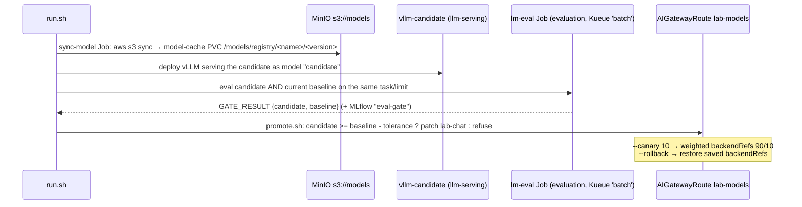

# 05 — Eval gate and promotion

Nothing ships without passing evals. This stage turns a model in
`s3://models/<name>/<version>` into a **candidate**, compares it against
what users currently get from the `lab-chat` alias, and only then moves
traffic, either all at once or as a weighted **canary**.



| File | What |
|---|---|
| `sync-model-job.yaml` | copies a model version from MinIO into the shared `model-cache` PVC |
| `candidate-vllm.yaml` | vLLM Deployment + Service `vllm-candidate` (served name `candidate`) |
| `candidate-backend.yaml` | gateway `Backend` + `AIServiceBackend` for the candidate |
| `eval-gate-job.yaml` | lm-eval on candidate and baseline → `GATE_RESULT` line + MLflow |
| `run.sh` | sync → deploy → eval, end to end |
| `promote.sh` | the gate: full promote, `--canary <pct>`, or `--rollback` |

```bash
./run.sh qwen2.5-0.5b-grpo-gsm8k v1                 # TASK=gsm8k LIMIT=200 by default
./promote.sh                                        # all traffic, if the gate passes
./promote.sh --canary 10                            # 10% of lab-chat traffic to the candidate
./promote.sh --rollback
# toy GPT: serve it with its 1024 context. Chat-completion evals only support
# *generative* tasks (gsm8k, triviaqa, ...), where a 125M model scores ~0. For the
# toy track, compare val_loss in MLflow and chat with it through the gateway instead.
MAX_LEN=1024 TASK=triviaqa LIMIT=100 ./run.sh toy-gpt-125m-sft v1
```

The baseline defaults to what `lab-chat` serves in
`gateway/03-ai-routes/ai-gateway-route.yaml` (`Qwen/Qwen2.5-1.5B-Instruct`
via the production-stack router). Override it with `BASELINE_URL` and
`BASELINE_MODEL`. A 0.5B model will usually *lose* to a 1.5B baseline. That's
the gate doing its job: compare against the 0.5B base model to see your
training gains instead.

How labs do this at scale: large private and public eval suites (capabilities,
safety, regressions), automated gates in the release pipeline, staged rollouts
(internal → canary → GA) with online metrics, and instant rollback via
routing. Here, promotion is just an alias move, which is why aliases exist.

Simplification: one `vllm-candidate` slot. A real registry would deploy
versioned Deployments (`vllm-<name>-<version>`) and keep the previous one
warm for rollback.
