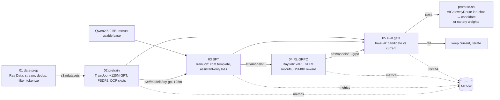

# Build your own model — the full lifecycle at toy scale

This track runs the same pipeline a frontier lab runs, shrunk to fit 1–8 lab
GPUs. Each stage is a Kubernetes workload on the platform you already
installed (Kueue, KubeRay, Kubeflow Trainer, MinIO, MLflow, vLLM, AI Gateway).
The narrative explanation is in [docs/14-build-your-own-model.md](../docs/14-build-your-own-model.md).



| Stage | Workload | GPUs (toy) | Wall time (rough, A100/H100-class) | Output |
|---|---|---|---|---|
| 01 data-prep | RayJob, CPU only | 0 | 20–60 min for 100k docs (mostly HF download) | `s3://datasets/pretrain/fineweb-edu-gpt2/*.bin`, `s3://datasets/sft/ultrachat/train.jsonl` |
| 02 pretrain | TrainJob (torchrun + FSDP2) | 1–8 | 15–45 min for 1B tokens on 8 GPUs; 15–60 min for the 130M-token default on 1 GPU | DCP checkpoints + HF-format GPT-2-style model |
| 03 SFT | TrainJob | 1 | 15–60 min | chat model in `s3://models/<name>/<version>` |
| 04 RL (GRPO) | RayJob (veRL) | 2–4 (1 node) | 1–4 h | RL-tuned model (GSM8K accuracy ↑) |
| 05 eval + promote | Job + Deployment + script | 1 for candidate serving | 10–30 min | eval scores, gateway alias moved |

Consumer GPUs (24 GB) work for every stage. Use smaller batch sizes and expect
longer run times.

## Two tracks through the same pipeline

* **Mechanics track (toy GPT)**: pretrain your own ~125M model from scratch,
  SFT it, serve it. It will be *bad* at everything, and that's expected: the
  goal is to understand every moving part.
* **Usable-results track (Qwen2.5-0.5B-Instruct)**: skip pretraining, SFT
  and/or GRPO a real small model, and actually watch eval scores move.

## Prerequisites

`training/01-object-storage` (MinIO + `minio-creds` in all namespaces),
`training/02-mlflow`, `training/03-kubeflow-trainer`, `training/04-kuberay`,
`platform/09-kueue` (LocalQueues `research` and `batch`),
`inference/01-model-storage` (`model-cache` PVC, `hf-token`), the gateway
(`gateway/03-ai-routes`).

## Run order

```bash
lifecycle/01-data-prep/run.sh                # MODE=pretrain (default) and MODE=sft
lifecycle/02-pretrain/run.sh                 # NUM_NODES=1 GPUS_PER_NODE=1 MAX_STEPS=2000
lifecycle/03-sft/run.sh                      # BASE_MODEL=s3://models/toy-gpt-125m/<run> or Qwen/Qwen2.5-0.5B-Instruct
lifecycle/04-rl-grpo/run.sh                  # Qwen2.5-0.5B-Instruct + GSM8K
lifecycle/05-eval-and-promote/run.sh <name> <version>
lifecycle/05-eval-and-promote/promote.sh     # or: promote.sh --canary 10
```
