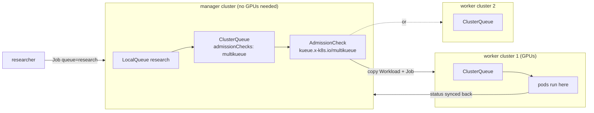

# Multi-cluster — how labs scale past one cluster

Big labs run **many clusters**: per region, per purpose (training, inference,
batch), and smaller ones for blast-radius reasons. Two OSS pieces make a
fleet feel like one system:

| Need | OSS | Here |
|---|---|---|
| Submit a job once, run it wherever there is GPU capacity | **Kueue MultiKueue** | `01-multikueue-kind/` (hands-on, two kind clusters) |
| Services that span clusters (global gateways, shared KV stores, failover) | **Cilium ClusterMesh** | docs below |
| Declarative fleet config | Argo CD ApplicationSets, Cluster API | docs/10, docs/21 |

## MultiKueue in one picture



The manager dispatches each workload to worker clusters that can admit it.
The first worker to admit wins, and the copies on the others are removed.
Users only ever talk to the manager.

## Cilium ClusterMesh (concepts)

ClusterMesh connects the Cilium datapaths of several clusters:

* **Global services:** annotate a Service `service.cilium.io/global: "true"` in
  each cluster, and endpoints from all clusters back it. Use it for gateway
  failover to a model replica in another cluster, or for a shared LMCache/KV
  tier.
* `service.cilium.io/affinity: local` prefers local endpoints and fails over
  remotely only when they're gone. That's what you want for latency-sensitive
  inference.
* **Network policy across clusters:** policies can select pods by
  `io.cilium.k8s.policy.cluster` label.
* Requirements: non-overlapping pod CIDRs, unique `cluster.name` / `cluster.id`
  per cluster, reachability between nodes, and `cilium clustermesh enable` +
  `cilium clustermesh connect`.

```bash
# sketch (two clusters already running Cilium with unique cluster.id)
cilium clustermesh enable --context c1 --service-type LoadBalancer
cilium clustermesh enable --context c2 --service-type LoadBalancer
cilium clustermesh connect --context c1 --destination-context c2
cilium clustermesh status --context c1 --wait
```

Exercise: recreate the main `kind/` lab twice with different `podSubnet`s and
`cluster.id`s, connect them, and make `sim-llama8b` a global service.
