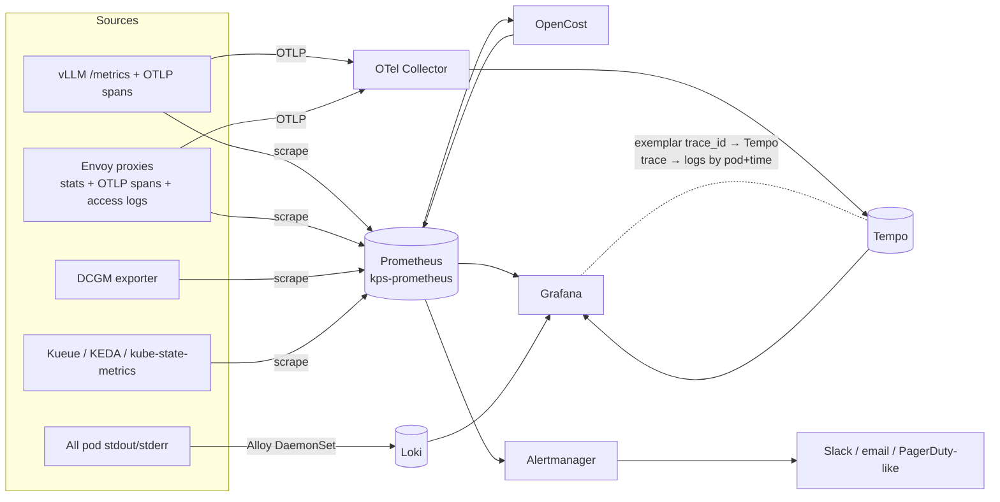

# Observability — metrics, traces, logs, cost in one Grafana

`platform/06-monitoring` gives you Prometheus + Grafana. This folder adds
what a production AI platform needs on top:

| Folder | Adds | Answers |
|---|---|---|
| `01-dashboards` | 3 provisioned Grafana dashboards | "How is serving / the GPU fleet / the scheduler doing?" |
| `02-alerts` | PrometheusRules incl. multi-window **SLO burn-rate** alerts | "Wake me up only when users are hurting" |
| `03-tracing` | OpenTelemetry Collector + **Tempo**; vLLM + Envoy tracing | "Why was *this* request slow — queue, prefill or decode?" |
| `04-logs` | **Loki** + **Grafana Alloy** | "What did the pod say right before it died?" |
| `05-cost` | **OpenCost** + cost-per-token recording rules | "What does 1M tokens of model X cost us? Which tenant uses most?" |

**Correlation is the point.** A latency spike on a dashboard → click an
exemplar → the slow trace in Tempo → "Logs for this span" jumps to Loki
filtered to that pod and time window. Each install script wires the
Grafana datasources so these links work (`grafana_datasource: "1"`
ConfigMaps picked up by the kube-prometheus-stack sidecar).

Install order: `01-dashboards` and `02-alerts` (just `kubectl apply`), then
`04-logs`, `03-tracing`, `05-cost`. Narrative + exercises:
[docs/16-advanced-observability.md](../docs/16-advanced-observability.md).

> Metric names drift between versions of vLLM (`gpu_cache_usage_perc` →
> `kv_cache_usage_perc`, `time_per_output_token` → `inter_token_latency`),
> DCGM exporter and Kueue. Panels use `or` fallbacks where practical; when a
> panel is empty, check the names on your `/metrics` endpoint.
