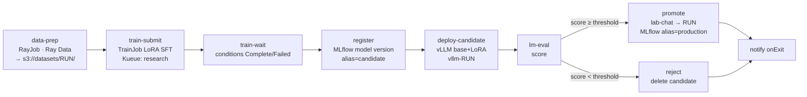

# model-release pipeline



| File | |
|---|---|
| `scripts-configmap.yaml` | Ray Data prep script (dataset → chat JSONL shards in MinIO) |
| `model-release-workflowtemplate.yaml` | the DAG, every step commented with *why* |
| `nightly-eval-cronworkflow.yaml` | 02:00 nightly eval of whatever `lab-chat` points to; fails on regression |
| `examples/run-model-release.yaml` | a concrete Workflow run |

```bash
kubectl apply -f scripts-configmap.yaml -f model-release-workflowtemplate.yaml -f nightly-eval-cronworkflow.yaml
argo submit -n training --from workflowtemplate/model-release -p run-name=gsm8k-lora-v1 --watch
# or: kubectl create -f examples/run-model-release.yaml
argo cron trigger -n training nightly-lab-chat-eval     # run the regression check now
```

Argo features this teaches:

* **resource templates**: create a RayJob/TrainJob and gate on its status
  (`successCondition: status.jobStatus == SUCCEEDED`)
* **DAG + `when`**: the eval score (an output parameter) decides promote vs reject
* **`templateRef`**: the nightly CronWorkflow reuses the `lm-eval` template
* **`onExit`**: the notification always runs
* `activeDeadlineSeconds` / `retryStrategy`: time budgets and retries per step
* `setOwnerReference`: deleting the Workflow garbage-collects what it created

Things to notice:

* Re-running with the same `run-name` fails at `data-prep`, because the
  objects already exist. That is deliberate: a run name is an immutable
  release id. Use a new one, or delete the old Workflow.
* Promotion patches the live route. If Argo CD manages that route, read the
  GitOps caveat in the template and docs/15.
* At lab scale the default threshold (0.25 gsm8k exact-match for a 0.5B
  model + LoRA) is a smoke test, not a quality bar. Real gates compare
  against the **current production score** on many evals, plus safety evals.
