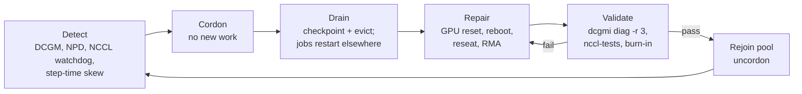

# Reliability — failures are the normal case

At 10k+ GPUs something fails every few hours (Meta reported ~419
unexpected interruptions in a 54-day, 16k-GPU Llama 3 run — roughly one
every 3 hours, ~60% GPU/HBM related). At lab scale you get the same
failure *types*, just rarer. This folder teaches you to **detect, absorb,
and recover** from them deliberately.

| Folder | What |
|---|---|
| `01-chaos-mesh` | install Chaos Mesh (CNCF) — fault injection as Kubernetes CRDs |
| `02-experiments` | hypothesis-driven experiments: kill vLLM mid-stream, slow the network, drop NCCL packets, kill an LWS worker, starve CPU, lose the KV-cache tier; a game-day Workflow; kind-friendly variants |
| `03-gpu-health` | node-problem-detector watching the kernel log for XIDs, a toy remediator that cordons bad GPU nodes, DCGM diagnostics as a pre-flight Job |

Narrative, SLO/goodput math and a game-day plan:
[docs/17-reliability-and-chaos.md](../docs/17-reliability-and-chaos.md).

## Failure taxonomy for GPU fleets

| Failure | Signal | Blast radius | Typical response |
|---|---|---|---|
| **XID errors** (driver-reported GPU faults: 48 DBE ECC, 63/64 row remap, 74 NVLink, 79 fell off the bus, 94/95 contained/uncontained ECC) | dmesg `NVRM: Xid`, `DCGM_FI_DEV_XID_ERRORS` | pod → whole training job | cordon, drain, reset/RMA, validate |
| **ECC / HBM degradation** | DCGM ECC counters, row-remap pending | silent corruption risk | retire pages, schedule repair |
| **NVLink / NVSwitch errors** | XID 74, DCGM NVLink error counters | TP groups slow or hang | drain node, fabric manager check |
| **NCCL hang / timeout** | step time → ∞, watchdog timeout in logs | entire synchronous job | kill + restart from checkpoint; find the bad rank |
| **Stragglers** (thermal throttle, bad PCIe, noisy neighbour) | per-rank step-time skew, clocks below max | whole job runs at slowest rank speed | detect & exclude node |
| **Node loss** (kernel panic, PSU, network) | NotReady | pods on it | reschedule, restart group (LWS/JobSet) |
| **Network fabric** (link flaps, congestion) | NCCL bus bandwidth drop, RoCE PFC storms | multi-node jobs | reroute, fix link |
| **Storage stalls** (NFS/S3 slow) | checkpoint/weight-load time spikes, D-state processes | startups and checkpoints | caching, parallel FS, async checkpoint |
| **Software** (OOM, bad image, config) | CrashLoopBackOff, OOMKilled | one deployment | rollback |

## The remediation loop hyperscalers automate

Key metrics:

* **MTTD / MTTR** — time to detect, time to restore capacity.
* **Goodput** = useful work ÷ (allocated GPU time). Lost to: restarts,
  work since last checkpoint, slow restarts (image pull, NCCL init,
  weight load), stragglers.
* **Serving availability** = SLO compliance (TTFT/ITL/error rate), not
  "pods running".
